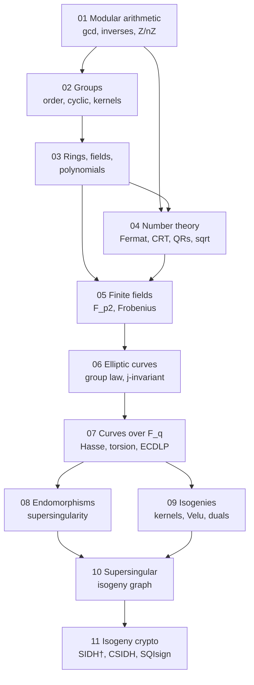

# From Zero to Supersingular: an Interactive Course

A self-contained course taking you from modular arithmetic to
supersingular isogeny graphs and the cryptography built on them — the
mathematical stack under SIDH's rise and fall, CSIDH, SQIsign, and this
repository's ECDLP research program.

Three interlocking tracks; every claim in the text is executed by code
you can run and modify:

* **Modules** (`modules/01…11.md`) — the theory: definitions, worked
  numeric examples, proofs or honest proof-sketches, and self-check
  questions with hidden solutions (click the ▶ arrows).
* **Labs** (`labs/lab01…06.py`) — pure-Python, zero-dependency
  implementations of the entire stack: `xgcd` → finite fields F_p and
  F_{p²} → curve group law → ECDLP attacks → Vélu's formulas → a
  verified supersingular 2-isogeny graph. Each lab self-checks with
  assertions, then demos. See [`labs/README.md`](labs/README.md).
* **Interactive playground** (`interactive/index.html`) — open in any
  browser: a modular-arithmetic explorer, the chord-and-tangent law over
  ℝ (click to add points), full curve groups over F_p, and a clickable
  supersingular isogeny graph for p = 83, 431, 1013 with random-walk
  animation — the exact graphs lab 06 builds and verifies.

## The road

| # | Module | Lab | Playground tab |
| --- | --- | --- | --- |
| 01 | [Modular arithmetic](modules/01-modular-arithmetic.md) | `lab01` | Modular |
| 02 | [Groups](modules/02-groups.md) | `lab01` | Modular |
| 03 | [Rings, fields, polynomials](modules/03-rings-fields-polynomials.md) | — | — |
| 04 | [Number theory toolkit](modules/04-number-theory.md) | `lab01` | Modular |
| 05 | [Finite fields](modules/05-finite-fields.md) | `lab02` | — |
| 06 | [Elliptic curves & group law](modules/06-elliptic-curves.md) | `lab03` | Curve ℝ, Curve F_p |
| 07 | [Curves over F_q & ECDLP](modules/07-curves-over-finite-fields.md) | `lab03`, `lab04` | Curve F_p |
| 08 | [Endomorphisms & supersingularity](modules/08-endomorphisms-supersingular.md) | `lab03`, `lab06` | Isogeny graph |
| 09 | [Isogenies & Vélu](modules/09-isogenies.md) | `lab05` | — |
| 10 | [The supersingular graph](modules/10-supersingular-graphs.md) | `lab06` | Isogeny graph |
| 11 | [Isogeny cryptography](modules/11-isogeny-crypto.md) | capstone | Isogeny graph |

## How to take the course

1. Read a module; do the self-checks *before* opening the solutions.
2. Run its lab (`cd course/labs && python3 lab0N_*.py`); read the code —
   it is short on purpose; do at least one `EXERCISE` comment.
3. Open `interactive/index.html` and poke the matching tab until the
   objects feel like things, not definitions.
4. Finish with the module-11 capstone: a CGL hash on the p = 431 graph
   you built yourself.

Suggested pacing: modules 01–05 in one week if you've seen some algebra
(skim what you know — but *run the labs anyway*), one module per
sitting after that. Total ≈ 25–40 hours.

**Prerequisites:** comfortable programming, high-school algebra,
willingness to verify computations by hand. No prior abstract algebra
assumed — modules 01–05 build all of it.

**Honesty policy** (inherited from this repository's research rules):
proofs beyond course scope are labeled as sketches with named sources;
toy-scale computations are never presented as evidence about
cryptographic-scale objects (module 10 §5).

## References

Silverman, *The Arithmetic of Elliptic Curves* (GTM 106) · Washington,
*Elliptic Curves: Number Theory and Cryptography* · Galbraith,
*Mathematics of Public Key Cryptography* · Sutherland, MIT 18.783
lecture notes · De Feo, *Mathematics of Isogeny-Based Cryptography*
(arXiv:1711.04062) · Costello, *Supersingular Isogeny Key Exchange for
Beginners* · Charles–Goren–Lauter 2006 (hash) · Castryck–Decru 2022 /
Robert 2022 (SIDH break) · CSIDH (ASIACRYPT 2018) · SQIsign
(ASIACRYPT 2020) · Arpin et al., *Adventures in Supersingularland*.
