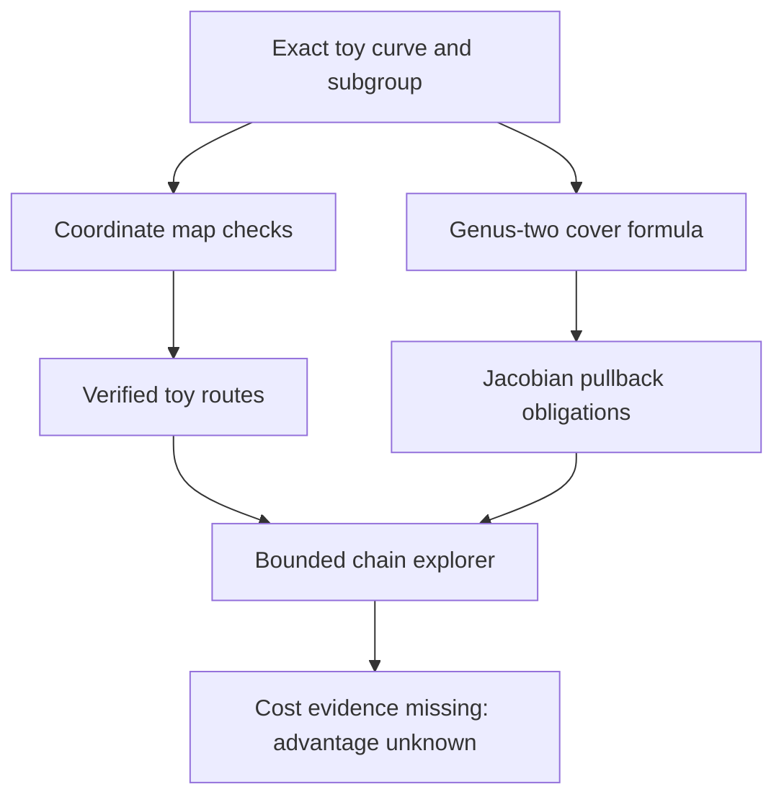

# Representation transfer explorer

An offline software prototype for bounded graph search over concrete representations
and explicit map obligations. It enumerates simple map chains, checks toy subgroup
homomorphisms, binds exact curve identities, and keeps destination performance
evidence separate from transfer correctness. It does not solve discrete logarithms.

## Run

From the repository root, with Python 3.11 or later and no added dependencies:

```sh
python3 tools/representation_transfer_explorer.py demo --output transfer.json --report transfer.md
python3 -m unittest discover -s tests -p test_representation_transfer_explorer.py -v
```

The CLI uses a fixed F_11 instance; it accepts no production curve or external
target. Output creation is exclusive, so repeated runs need distinct filenames.
This is development output, not a canonical harness run or ledger transition.

## What is implemented

| Component | Behavior |
| --- | --- |
| Representation identity | Hashes exact kind and metadata; elliptic metadata retains EC1 alias and global curve UID |
| Graph | Directed edges, ordered route identities, deterministic bounded breadth-first search, simple-path cycle prevention, explicit truncation |
| Map checks | Exhaustive identity, on-curve, scalar, injection and pairwise homomorphism checks on the declared toy cyclic subgroup |
| Coordinate changes | Forward/inverse maps (x,y) -> (s^2 x,s^3 y); exact destination generator and subgroup binding |
| Genus-two candidates | Degree-two cover C -> E, exact substitution certificate, squarefree polynomial check, all rational affine images checked |
| Obligation routes | Unimplemented Jacobian pullbacks stay visible without a verified badge |
| Cost accounting | Setup + target_count * (online + verification), transfer costs included, matching workload and units required |
| Scheduling | Structural diversity sorts retained paths; novelty and speedup remain unassessed |
| Controls | Zero map, injective nonhomomorphic permutation, singular cover, incompatible cost units and workload |

## The concrete cover

For the implemented toy short-Weierstrass models:

\[
E: v^2=u^3+a u+b,\quad C:y^2=x^6+a x^2+b,\quad f(x,y)=(x^2,y).
\]

The program checks that the degree-six polynomial is squarefree in the declared
odd characteristic. The curve C then has genus two. It checks the substitution
identity and every rational affine point image. This certifies the formula in
the tested model, not arithmetic in its Jacobian.

The graph's intended E -> Jac(C) edge is induced divisor pullback f^*, **not**
an inverse curve map or a choice of square root. The formal identity f_* f^*=[2]
would imply injection on an odd-order subgroup once the induced maps and the
identity are established. The demo chooses an odd prime-order subgroup, but
leaves the induced-map arithmetic and verification explicitly open. A degree-six
hyperelliptic model has two points at infinity, so naive odd-degree Mumford
arithmetic is not a valid substitute; balanced divisor arithmetic is required.

## Evidence and scoring

`verified_toy_subgroup` means exhaustive checks on a finite enumerated cyclic
subgroup. `formula_checked` means the curve-cover identity was checked.
`unimplemented` means a usable group map is missing; `rejected` means a declared
check failed. Paths inherit the weakest edge: a path containing an unimplemented
pullback is an obligation chain, even if earlier coordinate changes pass.

Every path currently has `advantage: null`: there is no destination algorithm
or matched benchmark. The library's `cost_assessment` evaluates supplied cost
models and labels them `model_estimate`. Missing data stays unknown; incompatible
units or workloads stay incomparable. Timings of software execution are not
ECDLP performance bounds. No rho, IC or generic solver is hidden in this tool.

Memory in `path_cost` is a maximum for sequential edge evaluation with freed
intermediates; the cost assessment also supplies a conservative sum of transfer
and destination storage. A benchmark must include persistent artifacts, failed
attempts, success probabilities and peak memory before either model is usable
as a performance claim. These functions do not validate a benchmark producer's
measurement methodology.

## Extension interfaces

`Explorer.add_node` records a representation with exact metadata and fingerprints.
`Explorer.add_edge` records map direction, a certificate, costs and open obligations.
`check_map` verifies an executable toy elliptic homomorphism. `Explorer.search`
searches constructed graphs; it does not synthesize arbitrary formulas or prove
that unvisited representations lack useful maps. Separate routes to a destination
remain distinct because their construction costs and obligations can differ.

Future research adapters can describe a Jacobian, restriction of scalars,
trace-zero variety or torus. Those type names alone provide no formula,
subgroup-injection certificate or speedup. Pairing/Weil-descent adapters, a native
genus-two group map and a non-IC/non-rho destination solver are not implemented.
There is no scaling conclusion from the toy demonstration and no automated
attack execution against deployed curves.

## Repository integration

This tool is an additive module under `tools/`, with focused unit tests under
`tests/`. It performs no ledger writes or official research-state transitions.
Its JSON can serve as an input to a later read-only UI integration; no dashboard
page or database migration is included. Curve identity uses the canonical EC1
preimage described in `docs/curve-identities.md`; changing generator, subgroup
or representation changes that identity. Representation and transfer UIDs are
separate namespaces, so a Jacobian is never mislabeled as an elliptic curve.



This diagram describes the software implementation. No canonical mathematical
relationship or published benchmark frontier is changed by this addition.
