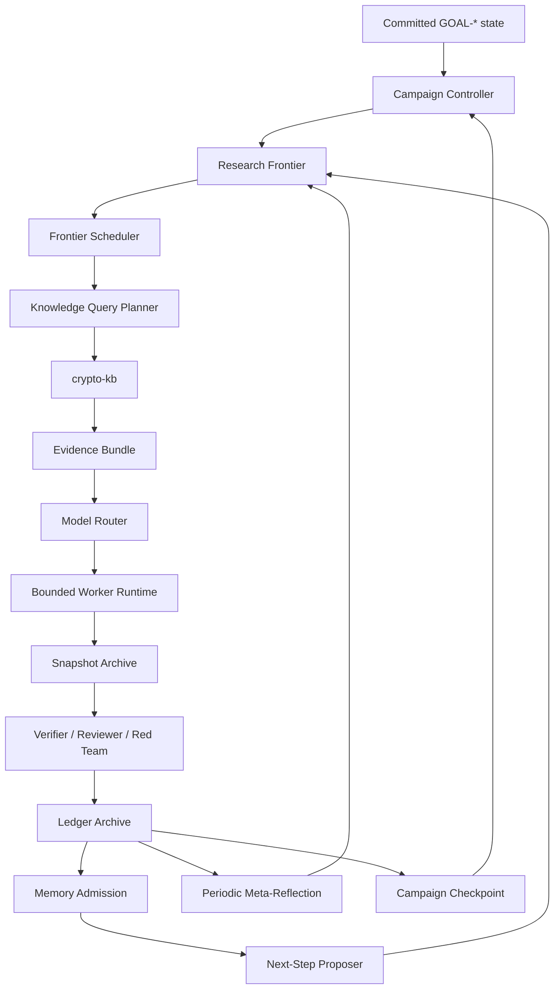

# Research Loop v2: Campaign Control, Adaptive Model Routing, and KB-Integrated Memory

**Status:** Proposed  
**Date:** 2026-08-08  
**Scope:** Control-plane architecture; no claim or experiment status changes  
**Related:** `docs/dynamic-subagent-dispatch.md`, `docs/focused-autoresearch-loop.md`, `docs/control-plane-primacy.md`, `docs/inference-backends.md`, `docs/claims-and-verification.md`, `kb/README.md`, `orchestration/model-policies.yaml`

## Executive summary

The repository already contains most of the right primitives:

- a single canonical Coordinator with exclusive authority over official state;
- bounded task cards, independent review, snapshot archives, and ledger archives;
- persistent `GOAL-*` records with an explicit `next_action`;
- capability-based model policies and concrete backend bindings;
- a checkpointed one-task agent runtime; and
- an auditable S3/filesystem -> Qdrant -> MCP knowledge base.

The missing layer is an executable **campaign controller**. Today the indefinite research loop, empty-frontier recovery, knowledge gathering, successor generation, and much of model selection are obligations written in prompts and skills. The `api_direct` graph correctly ends when one worker returns a final response, but there is no higher-level state machine that interprets that event as “one task finished; verify it, learn from it, and select the next task.” Consequently, a valid worker completion can become an accidental campaign completion.

Research Loop v2 adds that higher-level state machine without weakening any evidence gate. It introduces:

1. a persistent research frontier rather than a single next prompt;
2. mandatory successor generation after every verified checkpoint;
3. retrieval-before-routing through the existing crypto knowledge base;
4. a rule-based, auditable model router that uses cheap models for bounded work and stronger models for novel reasoning, reflection, and adversarial review;
5. verifier-driven escalation rather than self-reported model confidence;
6. memory admission and freshness controls so research results become reusable context without letting a model mint authoritative facts; and
7. telemetry and evaluations that permit routing to become learned only after project-specific evidence exists.

The worker still executes one bounded task. The campaign controller, not the worker, owns continuation.

## 1. Problem statement

The current architecture has four gaps between its documented intent and executable behavior.

### 1.1 Task completion and campaign completion are conflated

`orchestration/agent/graph.py` is a two-node model/tool loop. It stops when the model emits no tool call or when its step or wall-clock budget is exhausted. That is correct for a bounded task. It is not a campaign loop.

A worker returning prose such as “the requested analysis is complete” must mean only:

> This task attempt has reached a terminal worker state.

It must never mean:

> The research goal has no valuable successor.

### 1.2 Continuation exists in prose, not as a mechanically enforced invariant

`/coordinate-research-goal` already specifies an indefinite sequence of bounded batches and a fallback order when no task is ready. The system does not yet own a durable frontier, automatically invoke that fallback order, or require a structured explanation when it cannot create more work.

### 1.3 Model policy resolution is static rather than task-adaptive

The existing model policy layer correctly defines capability floors and refuses silent downgrades. It already distinguishes mechanical execution, implementation, deep research, adversarial review, and breakthrough review. What it does not yet do is:

- classify each task using task and evidence features;
- retrieve context before deciding how difficult the task remains;
- choose among all bindings that satisfy the capability floor using expected quality, cost, and latency;
- run a cheap-first cascade only where output is independently checkable; or
- escalate from observed verifier failures.

### 1.4 The knowledge base is available but not part of the control loop

The KB has strong provenance, authority filtering, hybrid retrieval, exact-identifier handling, and bounded context expansion. It is not yet a required input to task planning and model routing. The idea-generation skill still describes manual repository gathering, and the task runner does not receive an immutable evidence bundle or KB freshness watermark.

## 2. Goals and non-goals

### Goals

- Keep an active research campaign running across bounded worker calls and process restarts.
- Require every verified result to update or refill a ranked research frontier.
- Make negative, anomalous, invalid, and infrastructure-failed outcomes produce distinct successor classes.
- Route deterministic and bounded work to tools or lower-cost models.
- reserve the strongest available reasoning policies for mechanism generation, proof search, anomaly interpretation, strategic pivots, meta-reflection, and high-impact review;
- retrieve and score relevant knowledge before routing;
- preserve the current policy floors, independent-session requirements, archive gates, and single-Coordinator rule;
- make route, retrieval, escalation, and continuation decisions reproducible and auditable; and
- gather enough telemetry to train or calibrate a project-specific router later.

### Non-goals

- Replacing the ledger, immutable run artifacts, or Git/object storage as sources of truth.
- Giving any worker or router authority to change official research state.
- Turning the Qdrant index into an authoritative database.
- Implementing GraphRAG, automatic ontology construction, or a learned router in the first release.
- Automatically promoting model-generated summaries into `KN-*`, `EV-*`, `H-*`, or `DEC-*` records.
- Removing bounded task budgets, independent review, or falsification requirements in the name of continuity.
- Maximizing concurrency. Loop continuity and worker concurrency are separate controls.

## 3. Architectural invariants

These invariants are stronger than implementation preferences.

1. **One canonical Coordinator.** Only the canonical control plane may admit tasks, archive results, change official state, or commit a campaign checkpoint.
2. **Workers cannot terminate campaigns.** A worker may terminate only its own task attempt.
3. **Retrieval precedes model routing.** The router must know what the project already knows before deciding how much reasoning to buy.
4. **Capability floors precede cost optimization.** Cost can select only among candidates that fully satisfy the requested policy and runtime constraints.
5. **Evidence precedes transition.** The existing snapshot, independent review, and ledger archive sequence remains authoritative.
6. **Failure is typed.** Hypothesis falsification, implementation failure, timeout, invalid receipt, contradictory evidence, and empty retrieval are never collapsed into one `failed` meaning.
7. **Every decision has provenance.** Retrieval plans, evidence bundles, route decisions, escalations, verifier outcomes, and frontier mutations are immutable artifacts or hash-bound checkpoint fields.
8. **Durable memory is admitted, not dumped.** Transcripts and model scratch output do not automatically become knowledge.
9. **The index is derived.** Git/object storage records remain authoritative; the KB records the source commit and index generation used by each task.
10. **No make-work.** An indefinite loop must still rank every task above doing nothing and must pause honestly when it cannot.

## 4. Target architecture



The architecture contains two nested loops.

### Worker loop

The existing model -> tools -> model graph executes one frozen task under a finite budget. It returns a structured `TaskResult` and immutable run artifacts.

### Campaign loop

The new controller loads committed state, selects frontier work, builds context, routes the task, executes and verifies it, updates memory, generates successors, reranks, and checkpoints. It continues until a harness-level terminal or pause condition is committed.

## 5. Campaign state machine

```text
LOAD_CHECKPOINT
    -> RECONCILE_LEDGER
    -> REFILL_OR_SELECT_FRONTIER
    -> PLAN_KNOWLEDGE_QUERY
    -> RETRIEVE_EVIDENCE
    -> CLASSIFY_AND_ROUTE
    -> EXECUTE_BOUNDED_TASK
    -> SNAPSHOT_ARTIFACTS
    -> VERIFY_RESULT
    -> LEDGER_ARCHIVE
    -> ADMIT_MEMORY
    -> PROPOSE_SUCCESSORS
    -> META_REFLECT_IF_DUE
    -> RERANK_FRONTIER
    -> COMMIT_CHECKPOINT
    -> LOAD_CHECKPOINT
```

The controller is event-driven and idempotent. A restart resumes from the last completed transition rather than replaying side effects.

### Pseudocode

```python
while True:
    state = campaign_store.rehydrate(goal_id)

    terminal = terminal_policy.evaluate(state)
    if terminal.is_terminal:
        coordinator.commit_terminal_decision(terminal)
        break

    node = frontier.select_ready(state)
    if node is None:
        refill = proposer.refill(state)
        frontier.admit(refill.proposals)
        if not frontier.has_ranked_work():
            coordinator.commit_pause(refill.no_work_reason, refill.resume_action)
            break
        node = frontier.select_ready(state)

    query_plan = knowledge_router.plan(node, state)
    evidence = knowledge_client.retrieve(query_plan)
    route = model_router.route(node, evidence, state.budget)

    result = worker.execute(node.to_task(route, evidence))
    snapshot = coordinator.archive_snapshot(result)
    verification = verifier.verify(node, result, snapshot)
    decision = coordinator.archive_ledger(node, result, verification)

    admitted = memory_admission.evaluate(decision, result, verification)
    knowledge_writer.stage(admitted)

    successors = proposer.after_result(node, result, verification, decision)
    frontier.apply_outcome(node, successors)

    if reflection_policy.due(state, decision):
        guidance = meta_reflector.reflect(state, evidence)
        frontier.apply_guidance(guidance)

    frontier.rerank()
    coordinator.commit_checkpoint(state)
```

There is intentionally no `if model_says_done: break` branch.

## 6. Core contracts

All contracts use closed schemas, reject unknown fields, and carry a schema version.

### 6.1 `FrontierNode`

A frontier node is a proposed uncertainty-reducing action, not yet an official state transition.

```yaml
schema: crypto.autoresearch.frontier_node.v1
id: FRONTIER-ECDLP-000123
goal_id: GOAL-ECDLP-001
research_question_ids: [RQ-ECDLP-004]
kind: falsification_experiment
hypothesis_ids: [H-ECDLP-017]
claim: "The observed elimination-degree change persists across sampled l-isogenous neighbors."
mechanism: "..."
uncertainty_reduced: "..."
positive_consequence: "..."
negative_consequence: "..."
expected_information_gain: 0.82
decision_impact: 0.76
novelty: 0.48
falsifiability: 0.93
reproduction_readiness: 0.81
estimated_cost:
  wall_clock_seconds: 7200
  model_input_tokens: 18000
  model_output_tokens: 4000
  compute_class: cpu-medium
risk_flags: []
depends_on: [FRONTIER-ECDLP-000118]
deduplication_key: "..."
status: proposed
proposed_by:
  kind: after_result
  task_id: TASK-EXEC-118
  model_receipt: "..."
```

Required `kind` values initially include:

- `refine_hypothesis`
- `falsification_experiment`
- `replication`
- `control`
- `implementation_repair`
- `decompose_problem`
- `alternative_mechanism`
- `anomaly_investigation`
- `literature_gap`
- `synthesis`
- `meta_review`

### 6.2 `TaskEnvelope`

The task envelope extends the existing handoff without replacing it.

```yaml
schema: crypto.autoresearch.task_envelope.v1
task_id: TASK-...
frontier_node_id: FRONTIER-...
goal_id: GOAL-...
role: executor
task_type: experiment_execution
handoff: { ...existing fields... }
knowledge_contract:
  query_plan_id: KQP-...
  evidence_bundle_id: EB-...
  minimum_coverage: 0.70
  required_source_classes: [ledger, experiment, internal-note]
routing_contract:
  route_decision_id: ROUTE-...
  minimum_policy: executor-implementation
  cheap_first_allowed: false
successor_contract:
  required: true
  minimum_distinct_proposals: 3
  required_classes: [refine_hypothesis, control, alternative_mechanism]
```

### 6.3 `EvidenceBundle`

The evidence bundle is the bounded, immutable context supplied to a worker and to the model router.

```yaml
schema: crypto.autoresearch.evidence_bundle.v1
id: EB-20260808-0001
goal_id: GOAL-ECDLP-001
frontier_node_id: FRONTIER-ECDLP-000123
query_plan_id: KQP-20260808-0001
source_commit: 59b2878
index_generation: "qdrant-collection-v7@manifest-hash"
retrieved_at: "2026-08-08T...Z"
coverage:
  overall: 0.84
  canonical_prior_art: 0.72
  project_history: 0.95
  negative_results: 0.91
  contradictory_evidence: 0.63
freshness:
  index_at_or_after_source_commit: true
  direct_record_fallback_used: false
known_facts: []
prior_experiments: []
negative_results: []
contradictions: []
open_questions: []
passages: []
citations: []
retrieval_warnings: []
content_hash: "sha256:..."
```

Coverage is not a model confidence score. It is a deterministic or calibrated assessment of whether required evidence classes were found, how current they are, and whether the bundle contains unresolved contradictions.

### 6.4 `RouteDecision`

```yaml
schema: crypto.autoresearch.route_decision.v1
id: ROUTE-20260808-0001
task_id: TASK-...
features:
  task_type: experiment_execution
  novelty: 0.22
  mathematical_depth: 0.31
  ambiguity: 0.14
  tool_dominance: 0.87
  output_verifiability: 0.93
  kb_coverage: 0.84
  contradiction_score: 0.08
  previous_failed_attempts: 0
hard_requirements:
  minimum_policy: executor-implementation
  independent_session: false
candidates:
  - policy: executor-implementation
    backend: anthropic
    resolved_model_id: claude-sonnet-5
    capability_fit: pass
    estimated_cost: "..."
  - policy: executor-implementation
    backend: zai
    resolved_model_id: glm-5.2
    capability_fit: pass
    estimated_cost: "..."
selected:
  policy: executor-implementation
  backend: anthropic
  resolved_model_id: claude-sonnet-5
reason_codes: [ROUTINE_IMPLEMENTATION, HIGH_VERIFIABILITY]
escalation_policy:
  verifier_failure: research-deep
  repeated_failure_count: 2
  contradiction_threshold: 0.45
router_version: rules-v1
```

### 6.5 `TaskResult` and `VerificationOutcome`

A worker result is observations plus artifact references. It cannot set a hypothesis or goal status.

```yaml
schema: crypto.autoresearch.task_result.v1
task_id: TASK-...
attempt_id: ATTEMPT-...
worker_status: completed
stop_reason: completed
observations: []
artifacts: []
anomalies: []
limitations: []
suggested_followups: []
inference_receipt: "..."
```

```yaml
schema: crypto.autoresearch.verification_outcome.v1
task_id: TASK-...
verdict: pass
receipt_valid: true
claim_interpretation: inconclusive
baseline_comparison: no_improvement
failure_class: null
required_escalation: false
successor_constraints: []
review_artifacts: []
```

### 6.6 `CampaignCheckpoint`

A checkpoint binds runtime continuation to committed research state.

```yaml
schema: crypto.autoresearch.campaign_checkpoint.v1
id: CP-GOAL-ECDLP-001-000042
goal_id: GOAL-ECDLP-001
parent_checkpoint_id: CP-GOAL-ECDLP-001-000041
ledger_commit: "..."
last_task_id: TASK-...
last_decision_ids: [DEC-...]
frontier_snapshot_hash: "sha256:..."
active_frontier_nodes: [FRONTIER-...]
next_selected_node: FRONTIER-...
model_budget_remaining: { ... }
compute_budget_remaining: { ... }
index_generation: "..."
controller_lease_epoch: 17
created_at: "..."
```

## 7. Research frontier and successor generation

### 7.1 Frontier, not a FIFO queue

The dispatch queue answers “which approved tasks are ready to execute?” The research frontier answers “which possible actions are worth approving next?” Both are required.

The frontier contains alternatives, dependencies, branches, and archived dead ends. Selecting a node creates or updates the bounded dispatch queue; completing a dispatch task updates the frontier only after the ledger archive.

### 7.2 Mandatory successor invariant

After every ledger checkpoint, the controller must satisfy exactly one of these conditions:

1. at least one new or reprioritized actionable frontier node exists;
2. a declared goal completion criterion is met and committed;
3. a campaign budget or infrastructure condition causes a committed pause with a concrete resume action; or
4. the refill policy has failed to produce any action ranked above doing nothing, and a structured `NoWorkReason` is committed.

A worker is never asked whether the campaign should stop.

### 7.3 Required successor diversity

The proposer contract should normally request 5–10 proposals and require multiple mechanisms:

- at least two refinements or falsification attempts for the current mechanism;
- at least one control or replication;
- at least two alternatives that do not share the current mechanism’s core assumption;
- at least one proposal derived from an anomaly or negative result when present; and
- a synthesis or meta-review when enough evidence has accumulated.

Each proposal must specify what is learned under both positive and negative outcomes. Proposals that cannot alter a decision are rejected before admission.

### 7.4 Frontier scoring

The first version is deterministic and configured in `orchestration/frontier-policy.yaml`.

```text
score(node) =
    w1 * expected_information_gain
  + w2 * decision_impact
  + w3 * falsifiability
  + w4 * mechanism_novelty
  + w5 * reproduction_readiness
  + w6 * evidence_gap_coverage
  + w7 * portfolio_diversity_bonus
  - w8 * normalized_cost
  - w9 * execution_risk
  - w10 * duplication_penalty
```

The report must expose every component. The score ranks attention; it does not grade truth or promote a claim.

### 7.5 Outcome-to-successor rules

| Outcome | Default successor classes |
|---|---|
| Verified positive | replication, scale-up, adversarial control, mechanism generalization |
| Verified negative | alternative mechanism, assumption isolation, scoped rejection synthesis |
| Inconclusive | increase power, improve measurement, decompose, cheaper proxy |
| Anomalous | anomaly investigation, independent reproduction, instrumentation audit |
| Implementation failure | implementation repair, minimal reproduction, environment diagnosis |
| Invalid receipt | receipt repair only; no mathematical inference |
| Contradiction | high-tier synthesis plus independent adversarial review |
| Empty retrieval | query expansion or corpus ingestion before model escalation |

## 8. Knowledge-base integration

### 8.1 Integration boundary

The campaign controller depends on a small `KnowledgeClient` protocol rather than on Qdrant or MCP details.

```python
class KnowledgeClient(Protocol):
    def search(self, plan: KnowledgeQueryPlan) -> EvidenceBundle: ...
    def get_source(self, source_id: str) -> SourceRecord: ...
    def get_context(self, chunk_id: str, before: int, after: int) -> Context: ...
    def freshness(self, source_commit: str) -> FreshnessStatus: ...
```

Two adapters should exist:

- an in-process adapter for `api_direct` and tests; and
- an MCP adapter for Claude Code, Codex, and OpenCode.

Both produce the same schema and hashes.

### 8.2 Query planning

The knowledge router builds queries from the task rather than asking every worker to improvise retrieval. A normal plan requests:

- the current `GOAL-*`, `RQ-*`, and relevant `H-*` records;
- direct predecessors and dependencies;
- the strongest supporting and weakening evidence;
- negative results and failed approaches with the same mechanism or assumptions;
- contradictory records;
- canonical external literature;
- relevant experiment contracts, run receipts, and controls; and
- repository architecture or code context for implementation tasks.

Exact identifiers are resolved first. Semantic search fills conceptual gaps. Authority, evidence level, claim status, and supersession filters are explicit.

### 8.3 Bounded context

The evidence bundle should normally contain 4–8 primary passages plus compact structured summaries of exact records. The controller may expand context only when coverage is below the task’s declared minimum or a contradiction requires source inspection.

A cheap model may summarize retrieved material only after source selection. It may not select away contradictory or lower-scoring but required evidence.

### 8.4 Read-your-writes and freshness

The KB must not hide a newly committed negative result simply because ingestion is behind.

Every bundle records:

- the Git source commit against which the controller planned;
- the KB manifest or collection generation;
- whether the index is at or beyond that commit; and
- any direct-record fallback used.

When the index is stale, the client supplements retrieval with direct reads of newly committed ledger and knowledge records. The controller logs degraded retrieval but does not silently proceed as though the index were current.

### 8.5 Memory admission

The memory writer is a gate, not a transcript sink.

A result is considered for durable memory when at least one is true:

- a hypothesis or claim status changed through a Coordinator decision;
- an experiment produced a valid, interpretable result;
- an anomaly is reproducible enough to guide future work;
- a failure exposes a reusable implementation or experimental lesson;
- a contradiction or assumption dependency was identified; or
- a strategic reflection changes frontier policy or search coverage.

Model output enters as `model-suggested` metadata or as a draft record. Authoritative fields are derived deterministically or committed by the Coordinator after verification. The existing provenance rules remain unchanged.

### 8.6 Memory classes

The existing KB source types remain canonical. The controller additionally labels retrieval intent:

- **canonical knowledge:** papers, proofs, standards, known bounds;
- **project knowledge:** code, architecture, protocols, schemas;
- **research memory:** hypotheses, experiments, receipts, negative results, anomalies;
- **strategic memory:** dead ends, recurring failure patterns, frontier coverage, meta-reflections.

These are retrieval facets, not a second source-of-truth taxonomy.

## 9. Adaptive model routing

### 9.1 Reuse the current policy layer

Research Loop v2 does not replace `model-policies.yaml`, `model-bindings.yaml`, or `orchestration.adapter`. The existing policies define capability and safety floors. The new router selects the least expensive eligible policy/backend combination that is expected to satisfy the task, and records why.

### 9.2 Initial tiers

| Tier | Existing mechanism | Intended work |
|---|---|---|
| T0 | deterministic tools | parsing, grep/search, schema validation, calculations, experiment execution where no model judgment is needed |
| T1 | `executor-mechanical` | extraction, formatting, query expansion, log normalization, receipt packaging, bounded summaries |
| T2 | `executor-implementation` | routine coding, debugging, experiment implementation, straightforward result analysis |
| T3 | `research-deep` / Coordinator policies | hypothesis generation, experiment design, mathematical analysis, anomaly interpretation, synthesis, pivots, meta-reflection |
| T4 | `review-adversarial` / `review-breakthrough` | independent claim review, contradictions, closure, claimed breakthroughs |

Tiers are explanatory labels. The policy IDs and resolved model receipt remain authoritative.

### 9.3 Routing pipeline

1. Build the evidence bundle.
2. Classify the task using deterministic fields and, only when needed, a low-cost classifier.
3. Apply hard gates: role, tool surface, policy floor, context size, independent-session requirement, prohibited downgrade, and claim impact.
4. Enumerate all eligible policy/backend/model bindings.
5. Estimate quality, cost, latency, and verifier burden.
6. Select a route and emit an immutable `RouteDecision`.
7. Execute.
8. Verify output against task-specific checks.
9. Accept, retrieve more evidence, retry, or escalate according to the recorded policy.

### 9.4 Tasks routed directly to strong reasoning

The following skip cheap-first execution:

- novel hypothesis or mechanism generation;
- meta-reflection over a research epoch;
- proof search or proof decomposition;
- interpretation of an unexpected mathematical result;
- contradiction resolution;
- strategy pivot after repeated failures;
- evaluation of a potentially publishable claim; and
- any proposed official closure or breakthrough transition.

A cheap model may prepare structured evidence for these tasks, but it does not own the conclusion.

### 9.5 Tasks eligible for cheap-first cascades

Cheap-first is allowed only when output is bounded and independently verifiable, for example:

- extracting identifiers, assumptions, tables, or run metrics;
- normalizing logs into a schema;
- producing candidate KB queries;
- deduplicating proposals using deterministic similarity features;
- generating a first-pass summary whose citations and coverage are checked;
- reformatting records; and
- reproducing a frozen command and packaging artifacts.

### 9.6 Escalation signals

Escalation is based on observed evidence, not solely on a model saying it is uncertain.

Escalate or reroute when any configured trigger fires:

- schema or completion-gate failure;
- verifier rejection or material omission;
- unresolved contradictory evidence;
- low KB coverage after query expansion;
- repeated failure of the same route;
- route/model disagreement in the inference receipt;
- mathematical depth or novelty above the route’s calibrated envelope;
- task impact changes from routine to claim-changing; or
- publication, closure, or breakthrough review is required.

Low KB coverage first triggers retrieval expansion or corpus ingestion. A larger model cannot reason from missing evidence.

### 9.7 Budget-aware selection

Within the eligible set, the router approximates:

```text
utility(model, task) =
    P(task passes verification | model, task, evidence) * research_value(task)
  - lambda * expected_inference_cost
  - mu * expected_latency
  - nu * expected_retry_cost
```

The first implementation uses rules and measured per-binding prices. It does not invent precision where no calibration data exists. A route report may say “unmeasured; policy default” until enough task outcomes have accumulated.

### 9.8 Learning roadmap

- **v1:** deterministic rules and explicit escalation.
- **v1.5:** calibrate thresholds and per-route success probabilities from project telemetry.
- **v2:** train a supervised quality/cost predictor on verified task outcomes.
- **v3:** contextual bandit or online router for eligible low/medium-impact tasks.

Hard policy floors, independent review, and breakthrough gates remain non-learned constraints in every version.

## 10. Verification and reflection

### 10.1 Task-specific verification

Every routable task type declares a verifier:

- schema checks for extraction and formatting;
- command exit, artifact hashes, and expected outputs for mechanical tasks;
- tests and static checks for implementation;
- reproduction and control checks for experiments;
- citation and coverage checks for synthesis; and
- independent model/session review for claim interpretation.

The router optimizes for passing these verifiers, not for producing persuasive prose.

### 10.2 Immediate reflection

After a verified result, the next-step proposer receives accepted and rejected evidence and emits typed successors. It must explicitly state the shared assumptions among proposals so the frontier can penalize a false appearance of diversity.

### 10.3 Epoch meta-reflection

A separate strong-model task runs after a configured number of ledger decisions or when triggered by stagnation, contradiction, repeated failure, or frontier collapse. It examines:

- overexplored and unexplored mechanism regions;
- assumptions shared by multiple failed hypotheses;
- anomalies that have not been generalized;
- experiments with low decision value;
- evidence contradictions;
- promising results that lack scale, controls, or proof decomposition;
- duplicate proposal patterns; and
- route classes that repeatedly escalate.

It produces strategic guidance and frontier mutations, not official claim transitions.

## 11. Persistence, authority, and recovery

### 11.1 Authoritative and derived state

**Authoritative and committed:** `GOAL-*`, `RQ-*`, `H-*`, `EXP-*`, `EV-*`, `DEC-*`, `KN-*`, handoffs, immutable run artifacts, reviews, and campaign checkpoints.

**Durable but derived:** frontier snapshots and route decisions. They are hash-bound to checkpoints and reconstructable from authoritative records.

**Runtime cache:** a local SQLite state store/checkpointer under `.local/`, rebuildable from committed checkpoints and the ledger.

**Search index:** Qdrant, rebuildable from Git/object storage and manifests.

### 11.2 Canonical-controller lease

The campaign controller records a lease owner, lease epoch, source commit, and heartbeat. A second runtime may inspect or produce assigned artifacts, but it cannot advance the checkpoint without the current lease and Coordinator authority. Lease loss pauses scheduling before any state-changing action.

The lease is a coordination mechanism, not a substitute for the single-Coordinator rule.

### 11.3 Idempotency

Every transition uses stable IDs:

- `frontier_node_id`
- `task_id`
- `attempt_id`
- `query_plan_id`
- `evidence_bundle_id`
- `route_decision_id`
- `checkpoint_id`

Archive operations retain their existing commit/hash verification. Replaying a completed transition returns the prior receipt instead of generating a second official record.

### 11.4 Failure behavior

| Failure | Controller behavior |
|---|---|
| Worker returns no tool call | complete this task attempt; continue campaign processing |
| Worker exhausts budget | record infrastructure/budget outcome; generate resume or decomposition successor |
| KB unavailable | use direct exact records where possible; mark retrieval degraded; pause high-impact tasks that lack required coverage |
| Index stale | supplement with direct records and enqueue ingestion |
| No eligible model satisfies policy | pause as infrastructure; do not downgrade silently |
| Verifier rejects output | retry or escalate according to route decision; retain failed attempt |
| Controller crashes | resume from last checkpoint and idempotency receipts |
| Frontier empty | run refill ladder; pause only with structured no-work reason and resume action |

## 12. Observability and evaluation

### 12.1 Route telemetry

Every invocation records:

- task and evidence features;
- eligible and rejected candidates with reasons;
- selected policy, backend, model, and reasoning effort;
- input/output/cache tokens, cost, latency, and retries;
- verifier outcome and failure class;
- escalation path;
- final model required; and
- downstream research value signals such as accepted successor nodes or state-changing evidence.

### 12.2 Loop metrics

- percentage of ledger checkpoints that leave at least one ranked successor;
- accidental campaign-stop count;
- frontier age, breadth, and mechanism diversity;
- duplicate proposal rate;
- orphan task and unarchived-artifact count;
- negative-result reuse rate;
- checkpoint recovery success;
- low-information task rate; and
- information gain or decision impact per dollar and per wall-clock hour.

### 12.3 KB metrics

- required-source-class coverage;
- citation completeness;
- exact-record recall;
- general conceptual recall;
- authority/filter correctness;
- stale-index incidents;
- direct-record fallback rate;
- contradiction retrieval rate; and
- unsupported synthesis rate on answer-level evals.

The current KB retrieval gates remain in force. Research Loop v2 should add answer-level evidence-bundle evaluations rather than treating passage recall as sufficient.

### 12.4 Router release gates

Before routing leaves shadow mode:

- zero violations of hard policy and independent-session constraints;
- zero silent downgrades;
- no regression on task-type verifier pass rates beyond an explicitly approved tolerance;
- a measured cost reduction against a premium-only baseline; and
- stable escalation behavior on adversarial and contradiction fixtures.

A learned router receives a narrower gate: it may optimize only tasks explicitly marked learnable and must fall back to rules when feature coverage or calibration is poor.

## 13. Compatibility and migration

- Dispatch queue v1 remains readable. New fields are optional until queue v2 is enabled.
- Existing handoffs without a route decision resolve using current role defaults and are labeled `legacy-static-route`.
- Existing workers continue to run one bounded task.
- Existing `model-policies.yaml` IDs remain immutable.
- Existing KB MCP tools remain available; the integration adds a typed client and evidence-bundle composition above them.
- Existing goals can enter shadow mode without changing scheduling: the new controller predicts frontier and route decisions while the Coordinator follows the current flow.
- A goal opts into active control only through an explicit committed campaign configuration.

## 14. Initial configuration

Proposed new configuration files:

```text
orchestration/frontier-policy.yaml
orchestration/router-policy.yaml
orchestration/reflection-policy.yaml
```

All thresholds and score weights are versioned and included in route/checkpoint receipts. Environment variables may choose a version but may not override hard evidence or review gates silently.

## 15. Decisions made by this proposal

1. Build a campaign controller above the existing worker graph; do not turn the worker graph into an unbounded loop.
2. Retrieve before routing.
3. Start with deterministic routing rules and verifier-driven escalation.
4. Reuse existing policy and binding infrastructure rather than adding vendor names to task logic.
5. Keep Git/object storage and the ledger authoritative; treat Qdrant and local loop state as derived.
6. Require successors after every verified checkpoint.
7. Run strong-model meta-reflection periodically and on explicit stagnation/contradiction triggers.
8. Defer learned routing, GraphRAG, and automatic ontology construction until telemetry demonstrates their value.

## 16. Research basis

The design borrows specific patterns rather than treating any one system as a complete template:

- **AI Scientist-v2** uses a progressive agentic tree-search process managed by an experiment manager, supporting the separation between branch selection and experiment execution: <https://arxiv.org/abs/2504.08066>.
- **RouteLLM** learns cost/quality routing preferences and reports substantial savings, supporting a telemetry-to-learned-router roadmap while not replacing hard capability gates: <https://arxiv.org/abs/2406.18665>.
- **Autonomous Scientific Discovery via Iterative Meta-Reflection** studies proposal, evaluation, and reflection cycles, supporting periodic strategy reflection over accepted and rejected outcomes: <https://arxiv.org/abs/2607.01131>.
- **Agent Memory: A Comprehensive Characterization** distinguishes memory formation, retrieval, and use, supporting explicit memory admission and retrieval contracts: <https://arxiv.org/abs/2606.06448>.
- **Continuum Memory Architecture** treats long-horizon memory as a lifecycle rather than a static lookup table: <https://arxiv.org/abs/2601.09913>.
- **MemRouter** explores lightweight routing for memory admission, supporting eventual learned admission only after rule-based provenance gates exist: <https://arxiv.org/abs/2605.00356>.

These works motivate architectural choices. They are not cryptanalytic evidence and do not weaken this repository’s verification requirements.
