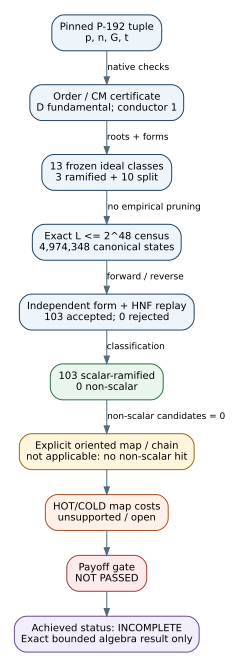

# Outcome

**Achieved result:** complete exact algebra census; no non-scalar relation in
the frozen box.

The run enumerated the preregistered P-192 class-relation search space
`product ell^|e_ell| <= 2^48` over the 13 frozen prime-ideal generators. Both
enumeration orders produced the same 4,974,348 canonical states and the same
set digest. Exactly 103 nonzero principal relations were found; all were
scalar ramified relations, and independent replay rejected none. No
non-scalar relation was found.

This is a finite algebra result, not a curve-weakness result. The full
experiment remains **INCOMPLETE** because explicit globally oriented maps,
point evaluation, 368 HOT/COLD calibration records, terminal isomorphisms,
and a fully charged payoff comparison are unavailable. Consequently, the
payoff gate did not pass and no speedup or structural P-192 weakness is
asserted.

# Exact object and certificate chain

The object is the valid NIST P-192 / secp192r1 curve, not the singular
companion used by the separate implementation-validation experiment. The
pinned tuple, group-order checks, and CM data are recorded in
[`order.json`](order.json):

- `p` and `n` pass a fixed 20-base probable-prime check and retain their
  SEC 2 / FIPS pinned-standard provenance; they are not presented as new
  recursive primality proofs.
- `G` is on the curve, `G != O`, and `[n]G = O`; the Hasse interval has a
  unique compatible multiple, fixing `#E(F_p)=n`.
- `D=t^2-4p=-5*11*31*C` is squarefree and fundamental. A recursive
  Pocklington certificate proves `C` prime, so the Frobenius conductor is one
  and `End(E)=Z[pi]=O_D`.
- Every non-scalar `alpha` in this order has a certified norm lower bound of
  approximately `2^191.941` (the exact integer is in `order.json`). This is
  strictly above the frozen `2^48` lane.

[`generators.json`](generators.json) records all 13 oriented generators,
their modular roots, reduced forms, and cross-checks. It also records passing
ramified-square controls at 5, 11, and 31; a non-scalar positive control at
`D=-23`; and the symbolic P-192 `C`-degree control. The symbolic control is
outside the buildable factor base and does not imply an attack.

# Exact census and replay

The authoritative search certificate is
[`relations.json`](relations.json), and the independent verifier result is
[`verification.json`](verification.json). The extracted boundary view is
[`exact-boundary-manifest.json`](exact-boundary-manifest.json).

| quantity | forward | reverse | expected |
|:--|--:|--:|--:|
| oriented vectors | 9,948,061 | 9,948,061 | 9,948,061 |
| conjugation-fixed vectors | 635 | 635 | 635 |
| canonical vectors including zero | 4,974,348 | 4,974,348 | 4,974,348 |
| canonical nonzero vectors | 4,974,347 | 4,974,347 | 4,974,347 |
| scalar-principal states including zero | 104 | 104 | 104 |
| exact `L=2^48` vectors | 0 | 0 | 0 |

The forward and reverse canonical-set digest is identical (`xor` begins
`fa31a647` and ends `4573e`; `sum` begins `8eedade9` and ends `51806`). The
complete values are recorded in `exact-boundary-manifest.json`.

The exact-boundary encoding is empty because every generator prime is odd;
its SHA-256 is the standard empty-input digest (`e3b0c442...b855`; complete
value in the boundary manifest).
The radius-16 control examined the complete 2,997,268-state radius-8 half
ball, found zero duplicate classes after the specified scalar-ramified
quotient, and found no extra relation.

For each of the 103 retained relations, the verifier recomputed the exponent
vector, exact degree, reduced form, `alpha=(u,v)`, norm, scalar action, ideal
HNF, and principal HNF. It accepted all 103 and rejected none. The zero vector
was excluded separately. The result therefore says exactly that the frozen
box contains no non-scalar class relation; it does not cover larger degree,
other factor bases, other attack families, or all curves in the isogeny class.

# Payoff and transfer obligations

An abstract form identity does not transfer a discrete-log problem for free.
The required chain is: a globally Frobenius-oriented ideal, an explicit
kernel/map, subgroup preservation, evaluated points, a terminal isomorphism,
independent replay, and a costed advantage over a declared baseline. Here the
search produced no non-scalar candidate on which to attempt that chain.

[`weights.json`](weights.json) truthfully records `unsupported_open`: zero of
the required 368 calibration records were emitted because explicit P-192 maps
are not implemented. [`operation-counts.json`](operation-counts.json) records
the HOT and COLD tuples as null rather than fabricating zeros. No wall-clock
time or degree-linear proxy is substituted for those missing operation costs.

Thus the certificate field `claim_ceiling=NO_WEAKNESS_FOUND_WITHIN_SCOPE` is
only the maximum permitted claim. The achieved full-experiment status is
`incomplete-map-calibration-and-payoff-open`.

# Execution history and defects found

The first launcher attempt failed before child execution because
`/usr/bin/time` was absent; it consumed no experimental run. Two native
execution attempts then found real harness defects and are preserved:

1. Attempt 1 exposed an incorrect Bézout coefficient and a duplicated factor
   in generic binary-quadratic-form composition. The first corrupted product
   was the positive 103-by-107 class; the next 113 composition triggered the
   invariant assertion. The correction added exact divisibility checks and
   full-census regressions.
2. Attempt 2 completed the census but the exact verifier rejected six
   `log2_degree` values after JSON parsing changed them by one ULP. Enabling
   `serde_json`'s `float_roundtrip` parser retained exact equality. Regressions
   now preserve the formerly pathological value and reject one-ULP and NaN
   mutations.
3. Attempt 3, at code commit `78ba2da...e6669`, completed all five frozen
   phases with exit status zero. The release binary SHA-256 is
   `91a02361...c0111c`; `run.yaml` and the manifest retain the complete values.

Preserving these failures is part of the evidence: neither a panic nor a
serialization mismatch was reclassified as a mathematical result.

# Resources and statistical confidence

[`resource-metrics.json`](resource-metrics.json) derives directly from the
five records in [`isolation.jsonl`](isolation.jsonl). All phases were pinned
to CPUs 1–4 and marked uncontended. Their aggregate wall time was
39.733819654 seconds, with a maximum phase RSS of 639,024 KiB. The exact
search used 28.239448942 seconds; full certificate replay used 11.462448644
seconds.

These are single-run engineering observations. They have no sampling error
bar or timing confidence interval and support no throughput comparison. The
algebraic completeness claim instead obtains confidence from exhaustive
coverage under a frozen boundary, two enumeration orders with matching
digests, exact independent HNF/form replay, mutation regressions, theorem and
positive controls, and a SHA-256 artifact manifest.

# Verdict

Supported:

- complete exact algebra census; no non-scalar relation in the frozen box;
- 103 nonzero scalar-ramified relations, all independently replayed;
- no evidence of a useful class relation within the frozen factor base and
  norm boundary.

Not supported:

- that P-192 is structurally weak or its discrete logarithm is easier;
- that no useful relation exists outside this bounded search;
- that a relation on another curve automatically transfers an attack;
- any HOT/COLD map-cost, timing-speedup, or production-key claim.

The strongest achieved verdict is therefore **INCOMPLETE exact-algebra pass**,
with no non-scalar relation in scope—not a declaration that P-192 is weak and
not a global proof of strength.
