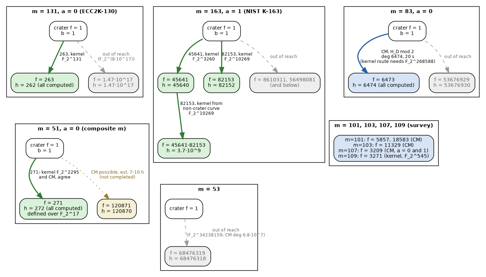

# Extensions (2026-10-08): the CM route, m = 51 / 53, and a second level on K-163

Follow-up to the [analogues](analogues/README.md) of the ECC2K-130 study. The
analogues used one route, the **kernel route**: kernel points in F_2^(m·k)
plus char-2 Vélu. It fails when the kernel field degree m·k is large, for
example at m = 83. This report adds three things:

1. A second route, the **CM route**: the conductor floor read off as the
   roots mod 2 of a class polynomial.
2. The m = 51 and m = 53 Koblitz classes.
3. A descent from a **non-crater** curve, which reaches the second level
   below the K-163 crater.

The diagram is [`reachability.svg`](reachability.svg) (source
[`reachability.dot`](reachability.dot)). The timing graph is
[`cm_route/polclass_scaling.svg`](cm_route/polclass_scaling.svg). Labels are as
in the main report: *derived*, *measured*, *independently verified*,
*proposed*. Standalone study: no ledger records were written.

## 1. The CM route (`cm_route/`)

**Method (derived).** Let E be a Koblitz crater over F_2^m and F a prime
dividing f_π. The F-floor is the set of curves in the class with End = Z + F·O_K.
Their j-invariants are the roots of the class polynomial H_D for
D = −7F², reduced mod 2. All of those roots lie in F_2^m, because π ∈ Z + F·O_K.

- PARI's `polclass(D, 1)` returns the class polynomial for the **Weber f**
  invariant. It is allowed here because D ≡ 1 (mod 8) and 3 ∤ D, and its
  coefficients are about 72× smaller than those of the j-polynomial.
- The modular relation (f²⁴ − 16)³ = j·f²⁴ reduces mod 2 to j = f⁴⁸. So every
  root r of H_D mod 2 gives the floor curve b = 1/j = r⁻⁴⁸.
- For each j, the model y² + xy = x³ + a₂x² + b with #E = N is chosen with
  `ellcard`.
- No kernel field is involved, so the cost is set by h(D) = F ± 1, not by the
  kernel field degree m·k.

**Correction to the earlier draft.** The first version of these scripts read
the roots as γ₂ = j^(1/3) and used b = r⁻³. That labelling was wrong: PARI's
invariant 1 is Weber f, not γ₂. The sets it produced were nevertheless
exactly right. Since r⁻³ = (r⁻⁴⁸)^(1/16) is a Galois conjugate, and every floor
is closed under Frobenius, the set of r⁻³ is the same set as the set of r⁻⁴⁸.
The corrected scripts use r⁻⁴⁸ and reproduce `floor6473.txt` and
`floor51_271_cm.txt` byte for byte. Each script also prints the check that the
two sets coincide. *Measured.*

**Validation against fully enumerated floors (`cm_validate.gp`) — independently verified.**

| class | floor | class-polynomial roots in F_2^m | equal to the floor enumerated by explicit isogenies + horizontal walks |
|---|---|---|---|
| m = 37 (volcano study) | f = 73 | 74 | 74/74 |
| m = 41 (volcano study) | f = 409 | 410 | 410/410 |

**m = 83, the 6473-floor (`cm83.gp`, `cyc83.gp`, `cover83.gp`, `check83.gp`).**
The analogues report said this floor could not be computed: the kernel route
needs F_2^268588, and PARI cannot build that field here. The CM route
computes the entire floor:

- **Field:** F_2[x]/(x⁸³ + x¹⁴ + x⁴ + x + 1); #E = 4 · 2417851639230796216685689.
- **Class polynomial:** D = −293298103, h = 6474. `polclass` takes 20 s, with
  maximum coefficient about 2^8136. *Measured.*
- **Roots:** 6474 roots in F_2^83, all distinct, all with a model of #E = N
  (a₂ = 0). They form 78 Galois orbits of 83. *Measured.*
- **Level, two checks:**
  - ord[𝔩₁₁] = 1079 in Cl(−7·6473²). The crater's 11-cycle is 1, and 10
    sampled floor curves each have 11-cycle 1079.
  - Six 11-cycles of length 1079 tile all 6474/6474 curves and visit no curve
    outside the root set.

  *Independently verified.* The full list is `floor6473.txt`.

**Rest of the survey (`survey/`).** The same script (`cm_floor.gp`) computed
the floors that the analogues survey marked as kernel-route infeasible. Each
row was checked the same way: h roots, #E = N for every model, and sampled
11-cycles equal to ord[𝔩₁₁], with no visited curve outside the root set.

| class (field modulus) | floor f | h | polclass | roots in F_2^m, #E = N | Galois orbits | ord[𝔩₁₁] | sampled 11-cycles |
|---|---|---|---|---|---|---|---|
| m = 101, a = 1 (x¹⁰¹ + x³⁹ + x² + x + 1) | 5857 | 5858 | 23 s | 5858, 5858/5858 | 58 | 2929 | 3/3 = 2929 |
| m = 101, a = 1 | 18583 | 18584 | 313 s | 18584, 18584/18584 | 184 | 18584 | 3/3 = 18584 |
| m = 103, a = 0 (x¹⁰³ + x⁹ + 1) | 11329 | 11330 | 75 s | 11330, 11330/11330 | 110 | 2266 | 3/3 = 2266 |
| m = 107, a = 0 (x¹⁰⁷ + x⁵⁸ + x² + x + 1) | 3209 | 3210 | 6 s | 3210, 3210/3210 (a₂ = 0) | 30 | 1070 | 3/3 = 1070 |
| m = 107, a = 1 | 3209 | 3210 | 5 s | 3210, 3210/3210 (a₂ = 1) | 30 | 1070 | 3/3 = 1070 |

*Measured; level independently verified.* Each crater's 11-cycle has length 1. No walk visited a
curve outside the root set. At m = 107, the a = 0 and a = 1 craters are quadratic twists (m is odd),
so their floors have the same j-invariants; only the a₂ of the model with #E = N differs.
The pentanomials are the first found by the script's search, not the standard ones; the floor
lists `survey/floor_m*.txt` are in those bases.

So every floor that the analogues survey marked as kernel-route infeasible, except those at
m = 97 (h ≈ 7.5·10⁵) and the very large primes, is computed by the CM route in minutes.

**Cost of the CM route (`scale_polclass.gp`, graph `polclass_scaling.svg`) — measured.**

| f | h | polclass time | max coefficient | size of H_D |
|---|---|---|---|---|
| 6473 | 6474 | 20 s | 2^8136 | 6 MB |
| 12011 | 12012 | 79 s | 2^16048 | 21 MB |
| 24019 | 24018 | 500 s | 2^33941 | 90 MB |

Each size was timed once on this 4-core container, with no repeats, so there
are no error bars. A least-squares fit gives time ∝ |D|^1.23 (the last segment is steeper, |D|^1.33). The largest
`polclass` for which any route is plausible on this machine is therefore
around h ≈ 10⁵: about 7–10 hours and about 2.4 GB at h = 120870.
*Extrapolated, not measured.*

## 2. m = 51 and m = 53 (`m51_m53/`)

`m5153.gp` gives the structure. *Derived.*

| class | f_π | per prime ℓ′: splitting, k, kernel field, h(floor) |
|---|---|---|
| m = 51 (a = 0 and a = 1) | 271 · 120871 | 271: inert, k = 45, F_2^2295, h = 272; 120871: split, k = 1185, F_2^60435, h = 120870 |
| m = 53 (a = 0 and a = 1) | 68476319 | split, k = 646003, F_2^34238159, h = 68476318 |

**m = 51, the 271-floor: computed by both routes, which agree.**
Field F_2[x]/(x⁵¹ + x⁶ + x³ + x + 1), crater y² + xy = x³ + 1.

- **Why 271 is cheap.** 271 is the conductor of Z[τ¹⁷]: the 271-floor is
  already defined over the subfield F_2^17, so every orbit has 17 curves.
  *Derived, measured.*
- **CM route (`cm51.gp`).** 272 roots, all with #E = N (a₂ = 0), forming 16
  Galois orbits of 17. *Measured.*
- **Kernel route (`iso51_kernel.gp`).** 40 random 271-isogenies were
  computed, with kernels in F_2^2295. This used `vert_gen.gp`, generalised so
  that Δ′ can lie in a proper subfield of a composite F_2^m: its
  minimal polynomial is now built from the actual Frobenius orbit. *Measured.*
- **Cross-check (`cross51.py`).** All 40 kernel-route images are in the CM
  set (40/40), and their orbit sizes agree. They reach 14 of the 16 orbits.
  *Independently verified.*

**m = 51, the 120871-floor: not completed.**
- **Kernel route.** Needs F_2^60435. Scaling the measured K-163 timings puts
  this at about a day per isogeny. *Extrapolated.*
- **CM route.** h = 120870, estimated at 7–10 h and about 2.4 GB from the
  scaling above. The run (`cm51_120871.gp`) was started twice, and both times
  a container restart killed it before `polclass` returned. No result is
  claimed.
- **The bottom.** Conductor 271·120871, h = 272·120870 ≈ 3.3·10⁷. Out of
  reach by either route. *Derived.*

**m = 53: out of reach by both routes.**
- **Kernel route:** needs F_2^34238159.
- **CM route:** needs a class polynomial of degree 68476318, about 570× the
  size of the m = 51 case above.

*Derived.*

## 3. A second level on K-163 (`second_level/`)

The analogues proposed this step but did not run it. In
`vert_down.gp`, the starting curve is a floor curve rather than the crater, so
its b is a general element of F_2^m. It has to be embedded in the kernel field
F_2^(mk), which is done without `ffembed`:

1. w = z^((2^(mk)−1)/(2^m−1)) generates F_2^m.
2. Its minimal polynomial μ_w defines S ≅ F_2^m.
3. A root R(t) of the field modulus in S gives the embedding x ↦ R(w).

Vélu with a₆ = b then gives Δ″ = b + v + v².

**Validation at m = 41 (`down41.gp`, `cyc41.gp`) — independently verified.**
The run starts from the 409-floor curve b = 5031829425 (a₂ = 0) over
F_2[x]/(x⁴¹ + x³ + 1) and computes two 1721-isogenies with kernels in
F_2^8815. They give b″ = 160615849777 and 51329513769, both with #E″ = N.
Both images have 23-cycle 2870 and 11-cycle 1722, the bottom-level values
from the m = 41 study. The starting curve has 205 and 82, the 409-floor
values.

**K-163 (`down163.gp`; NIST basis x¹⁶³ + x⁷ + x⁶ + x³ + 1, a₂ = 1).**

- **Start:** the 45641-floor curve
  b′ = 20183018253319052689704116247546275258431720285, whose 11-cycle 9128
  was already verified in the analogues.
- **Step:** one 82153-isogeny, with kernel in F_2^10269 on the twist.
- **Image:** b″ = 115992596105510058325208044366752339422280521227, a₂ = 1,
  with #E″ = N and a Galois orbit of 163. *Measured.* The log line of this run
  was lost in a container restart; the result line is in `down163.txt`.

**Level of b″, check 1: torsion structure (`lvl_check.gp`).**
Let ℓ′ be one of the two conductor primes. π acts as a scalar on E[ℓ′]
exactly when ℓ′ ∤ [End : Z[π]]. Over the kernel field, that means the ℓ′-part
of the twist's group order has rank 2 when ℓ′ ∤ [End : Z[π]], and is cyclic
(Z/ℓ′², with v = 2) when ℓ′ | [End : Z[π]]. The exponent of the ℓ′-part was
sampled with 4 random points per cell:

| curve | 45641-part (F_2^3260) | 82153-part (F_2^10269) | conductor implied |
|---|---|---|---|
| crater b = 1 | ℓ′¹: rank 2 | ℓ′¹: rank 2 | 1 |
| 45641-floor b′ | ℓ′²: cyclic | ℓ′¹: rank 2 | 45641 |
| level-2 b″ | ℓ′²: cyclic | ℓ′²: cyclic | 45641·82153 |

**Level of b″, check 2: 11-cycle length.** ord[𝔩₁₁] by level, from
`analogues/details.out`: crater 1, 45641-floor 9128, 82153-floor 10269,
45641·82153 level 82152. The 11-cycle through b″ has length **82152** (`cyc163_level2.out`, 18 min). *Independently verified.*

**Rerun (`down163b.gp`).** The descent was run a second time to recover the log line lost in the restart. PARI's
`random()` starts from the same default seed in every new `gp` session, so the rerun drew the same kernel and
reproduced b″ exactly, in 930 s (`down163b.out`). That shows the run is reproducible. It is not a second,
independent image. A second image would need a different seed (`setrand`).

**Status.** b″ is on the level of conductor 45641·82153, two steps below the
NIST K-163 crater, with h = 45640·82152 ≈ 3.7·10⁹ curves (23,002,560 Galois orbits). The two
level checks are independent of each other (torsion structure over F_2^3260 and F_2^10269; the
horizontal 11-cycle over F_2^163) and agree. *Measured; independently verified.*

## Limitations and next checks

- The CM route returns image curves, not isogenies. For the m = 83 floor,
  this run did not compute any explicit 6473-isogeny: no kernel polynomial of
  degree 3236, and no rational map. Computing those would need a
  Couveignes- or Lercier-style algorithm between known endpoints. *Proposed.*
- Timings come from a shared 4-core container, one run each.
- No rho was run on any curve here. The ECDLP consequence is unchanged from the
  main study.
