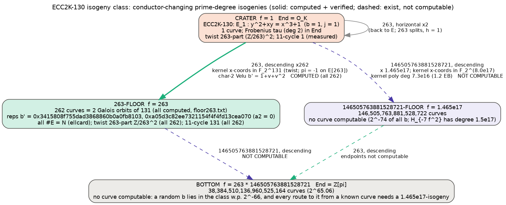

# Conductor-changing prime-degree isogenies of ECC2K-130

**Question.** Which prime-degree isogenies from the ECC2K-130 curve change the
conductor of the endomorphism ring, how large can that change be, and which of
them can actually be computed?

**Answer.**
- **Two prime degrees change the conductor.** Exactly two primes divide the
  Frobenius conductor f_π = [O_K : Z[π]] = 263 · 146505763881528721, so 263
  and 146505763881528721 are the only prime degrees whose isogenies change it.
  Every other prime degree, however large, gives a horizontal isogeny with
  conductor ratio 1. *Derived.*
- **All 262 descending 263-isogenies are computed and verified.** Each takes
  the conductor 1 → 263; their images are the entire 263-floor, 262 curves in
  2 Galois orbits. *Measured and independently verified.*
- **The 146505763881528721-isogenies exist but cannot be written down.** There
  are 146,505,763,881,528,722 of them from the crater, each taking the
  conductor 1 → 1.47·10¹⁷. Every representation of one, and every way of
  reaching its image curve, needs roughly 2^56–2^59 work and storage. That is
  comparable to solving the ECC2K-130 discrete logarithm with Pollard rho
  (≈ 2^60.8). *Derived.*

The full report, with every statement labelled DERIVED, MEASURED,
INDEPENDENTLY VERIFIED or PROPOSED, is [`report.pdf`](report.pdf) (source
[`report.typ`](report.typ)). The diagram is
[`volcano_ecc2k130.svg`](volcano_ecc2k130.svg) (source
[`volcano_ecc2k130.dot`](volcano_ecc2k130.dot)).

This is a standalone study: no ledger records were written, and nothing here
is a sealed `measured_bound`.

## 1. Object

- **Curve.** ECC2K-130: E: y² + xy = x³ + 1 over F_2^131. The field is
  represented as F_2[x]/(x¹³¹ + x⁸ + x³ + x² + 1), the SEC sect131 pentanomial.
  Curves E_b: y² + xy = x³ + a₂x² + b are named by the integer of b's
  polynomial-basis bits. The j-invariants themselves are basis-independent.
- **Group.** #E = 4 · ℓ, with ℓ = 680564733841876926932320129493409985129
  (prime, ≈ 2^129). Trace −22283658519494248867.
- **Endomorphisms.** K = Q(√−7), h(O_K) = 1, End(E) = O_K, and
  f_π = 263 · 146505763881528721. 263 splits in K; 146505763881528721 is inert.
- **Class numbers by level:** h(O_263) = 262;
  h(O_146505763881528721) = 146,505,763,881,528,722; bottom, h(Z[π]) =
  38,384,510,136,960,525,164 (≈ 2^65.06).

## 2. Which prime degrees change the conductor (derived)

An ℓ-isogeny between ordinary curves changes the conductor of the
endomorphism ring by at most a factor of ℓ (Kohel). A change is possible only
if ℓ divides [O_K : Z[π]] = f_π. For any other ℓ the isogeny is horizontal:
the conductor ratio is 1 and the endomorphism ring is unchanged. Here f_π has
exactly two prime factors, so the conductor-changing prime degrees are
**{263, 146505763881528721}**. Larger prime degrees exist, but none of them
changes the conductor.

## 3. The degree-263 isogenies: computed (`iso263.gp`, `check_levels.gp`, `orbits.py`)

- **Why they are cheap.** π ≡ −1 (mod 263·O_K), so π acts as −1 on E[263].
  Every 263-torsion point is therefore F_q-rational on the quadratic twist
  E_t: y² + xy = x³ + x² + 1, with the same x-coordinates. No extension field
  is needed. *Derived.*
- **The twist's 263-torsion is complete.** #E_t = 2 · 263² ·
  19678316408850118605767852657510239, and E_t(F_q) ≅ Z/(#E_t/263) × Z/263, so
  E_t[263] ≅ (Z/263)². *Measured.*
- **Construction.** A basis P1, P2 of E_t[263] was taken with Weil pairing of
  order 263. All 264 cyclic subgroups were enumerated, and for each kernel the
  image was computed with char-2 Vélu, b′ = 1/j′ = 1 + v + v², where v is the
  sum of the 131 half-kernel x-coordinates. That formula was checked against
  PARI `ellisogeny` on 6 random 73-isogenies at m = 37: 6/6 exact. *Measured.*
- **Results.**
  - 2 kernels map back to E itself (j = 1). These are the horizontal
    isogenies, which here are endomorphisms, since 263 splits and h = 1.
    *Measured, matches theory.*
  - The other 262 give **262 distinct curves**, the whole 263-floor, since
    h(O_263) = 262. Every one has #E = N by `ellcard`, with model a₂ = 0.
    *Measured.*
- **Level verification, by two independent invariants.**
  - **Twist structure.** Each image's twist has a cyclic 263-part Z/263²
    (262/262), against (Z/263)² at the crater. π is a scalar on E[263]
    exactly when 263 divides [End : Z[π]]. *Independently verified.*
  - **11-isogeny cycle.** The horizontal 11-isogeny cycle has length 131 on all
    262 images, equal to the order of [𝔩₁₁] in Cl(−7·263²); it is 1 on
    the crater. *Independently verified.*
- **Galois orbits.** The 262 floor curves form 2 Galois orbits of 131. *Measured.* Representatives:
  - b′ = 4326968845576522374067756648594374915 = `0x3415808f755dad3868860b0a0fb8103`
  - b′ = 13322536890716514976661127060580638832 = `0xa05d3c82ee7321154f4f4fd13cea070`

  The other 260 are their conjugates b′^(2^i); all 262 are in `floor263.txt`.

## 4. The degree-146505763881528721 isogenies: why they cannot be computed (`bigl.gp`)

Volcano theory guarantees them: ℓ is inert, so all ℓ + 1 = 146,505,763,881,528,722
ℓ-isogenies from the crater descend. *Derived.* Every way to compute one runs
into the same barrier:

| Route | What it needs | Size |
|---|---|---|
| Kernel points (Vélu, √élu) | x-coordinates of E[ℓ] | they lie in F_2^(131k), k = 6,104,406,828,397,030 (since π ≡ c mod ℓ with ord(c) = 1.22·10¹⁶ and −1 ∈ ⟨c⟩); one field element is 8.0·10¹⁷ ≈ 2^59.5 bits |
| Kernel polynomial over F_2^131 | (ℓ−1)/2 coefficients | degree 7.3·10¹⁶; storage ≈ 1.2 EB |
| Modular polynomial | roots of Φ_ℓ(1, Y) | degree ℓ + 1 ≈ 1.5·10¹⁷ in Y, with integer coefficients of order ℓ·log ℓ bits |
| CM construction of the image | Hilbert class polynomial of discriminant −7ℓ² | degree h = 1.5·10¹⁷ |
| Random search for an image curve | a random b on the ℓ-floor | probability 2^−74 |
| Square-root Vélu (√élu) | ≈ √ℓ ≈ 2^28.5 operations | but in the 2^59.5-bit field above |

*Derived.* Every route costs at least about 2^56 operations or bits. For
scale, Pollard rho on ECC2K-130 with Frobenius costs ≈ 2^60.8 steps, so
writing down one of these isogenies costs about as much as just solving the
discrete logarithm.

The same barrier blocks the other conductor-changing isogenies below the
crater: ℓ-isogenies from the 263-floor to the bottom, and 263-isogenies from
the ℓ-floor to the bottom, whose endpoints cannot be reached. The bottom itself
cannot be reached either. A random b lies anywhere in this isogeny class with
probability 2^−66, and every route from a known curve passes through an
ℓ-isogeny. *Derived.*

## 5. What this means for ECDLP (scoped)

- **Transfer is free.** The 263-isogenies are explicit and cheap, so moving an
  ECC2K-130 discrete logarithm onto any 263-floor curve costs almost nothing.
  *Derived.*
- **But it gives no speedup.** A 263-floor curve has no Frobenius
  endomorphism; its cheapest non-integer endomorphism has degree
  ≥ 7·263²/4 ≈ 121,045. By the measured m = 37 and m = 41 volcano studies
  (`research/isogeny_volcano_rho_20261005`,
  `research/isogeny_volcano_rho_m41_20261006`), rho there runs with negation
  only, needing ≈ √131 ≈ 11.4× more steps than on ECC2K-130 itself.
  *Extrapolated from measurements at m = 37 and 41, not measured at m = 131.*
- **The large-degree side is not even reachable.** No level below the crater
  is reachable except the 263-floor. *Derived.*

## Files

| file | role |
|---|---|
| `structure.gp` / `.out` | trace, #E, f_π, eigenvalue orders, class numbers, Cl orders |
| `iso263.gp` / `.out` | all 264 rational 263-isogenies; `floor263.txt` lists the 262 floor curves (b′, a₂); `iso263_raw.txt` the per-subgroup output |
| `check_levels.gp` / `.out` | twist 263-structure and 11-cycle level checks |
| `orbits.py` / `.out` | Galois orbits of the floor |
| `bigl.gp` / `.out` | size estimates for the 146505763881528721-isogenies |
| `volcano_ecc2k130.dot` → `.svg` / `.png` | diagram |
| `report.typ` → `report.pdf` | status-labelled report |
| `SHA256SUMS` | hashes of the scripts |

Reproduce with PARI/GP ≥ 2.15: `gp -q -s 2G structure.gp`, then `iso263.gp`,
`check_levels.gp`, `bigl.gp`, then `python3 orbits.py`. The whole run takes
under a minute.
