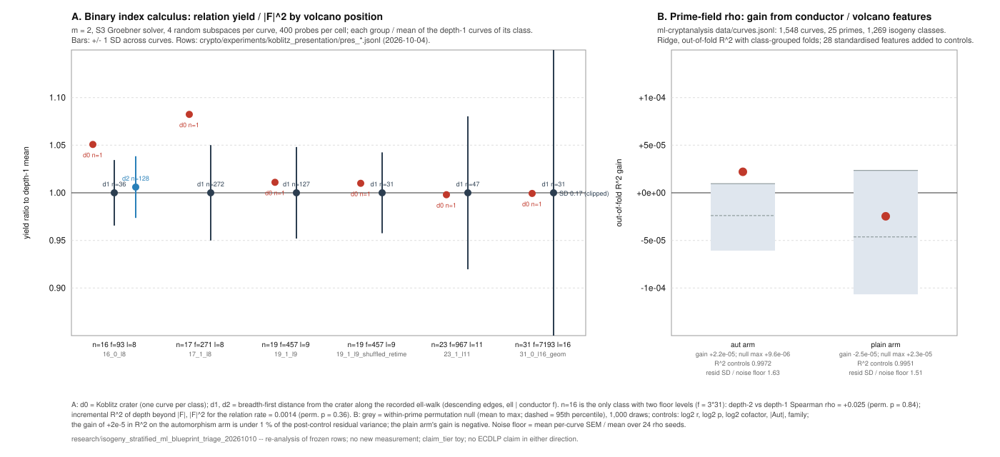

# Isogeny-stratified ECDLP ML blueprint: lead-by-lead triage against the evidence already on file

**Date:** 2026-10-10. **Kind:** triage of a supplied research blueprint plus two
re-analyses of frozen data. **No new measurement was run.** No research state
changes here; nothing is approved, promoted or closed by this note.
**Claim tier:** toy. **ECDLP claim:** none, in either direction.

**Input.** "Isogeny-Stratified ECDLP Machine Learning Research, end-to-end
technical blueprint, version 1.0, October 2026" (9 pages; SHA-256
`276fab868c001bf7d8932a4e64ada7a5e585160c5ea1d6d3cc427c679ffbf725`). The
document calls itself "an implementation-ready specification, not a measured
experimental dataset or a demonstration of any cryptographic vulnerability";
its example records are synthetic. It is not committed here (the repository's
report pipeline publishes every `research/**/*.pdf`); the hash identifies it.

**Repositories read**, at the commits below. Every pointer in this note is a
path in one of them.

| repo | commit | role |
|---|---|---|
| `aburan28/crypto` | `3da0029607dacb6f82aec6ef7f23ad2b7ec1d4d2` | Rust cryptanalysis suite, binary and prime isogeny tooling, frozen experiment rows |
| `aburan28/cryptanalysis` | `605ed9c6b790f078158510fb0bbfca6b240ed0fa` | ECC2K-130 class study, C core, mirrored suite |
| `aburan28/ml-cryptanalysis` | `fe306baf9f7e561f73fdcb04708f305d896ac726` | prime-field curve x invariants x measured-cost program ("CSD") |
| `aburan28/crypto-autoresearcher` | `85e1d32b7851738cf371a209c6591ba89928df81` | ledger, knowledge corpus, frontier map |

## 0. Verdict in one paragraph

The blueprint's leads are not new to this program: each of its four
hypotheses has been tested, most of them several times, across the three
code repositories and the ledger, and every measured result is a null
within the tested scope. The blueprint adds a statistical and ML framing
(class-grouped splits, shuffled-conductor nulls, tabular then graph models,
active selection). Applying exactly that framing to the frozen rows that
already exist gives the same answer: on the only binary isogeny class on file
with two floor levels, volcano position explains 0.14 % of the variance in
relation rate beyond factor-base size (permutation p = 0.36); on 1,548
prime-field curves with conductor, class-group and volcano features, the
feature block changes out-of-fold R² by 2 x 10⁻⁵ against controls that
already reach 0.997. The blueprint's own stop rule ("No verified relation
advantage: publish null result and stop expensive scaling", §19) therefore
applies before its phases 4 to 6 (tabular ML, graph ML, productisation) are
built. What is genuinely open is narrower than the blueprint and is stated in
§4, with the records that already carry it.

## 1. The four hypotheses against the evidence

Labels: **measured** = a run with retained artifacts; **derived** = a proof or
exact computation; **independently verified** = a second implementation or
reviewer re-derived it; **proposed** = a design that has not run.

| blueprint hypothesis | status | strongest evidence (path, scope) |
|---|---|---|
| **H0** conductor and graph features have no incremental predictive value beyond matched controls | **supported in every tested scope** (prime-field rho; binary summation-polynomial index calculus at m = 2; n = 131 class structure) | §3 of this note (measured, re-analysis); `ml-cryptanalysis/experiments/anomaly-search/report.md` (measured: 1,545 curves, 0 replicated anomalies, neighbour cost ratios within error of 1 after the \|Aut\| discount); `ml-cryptanalysis/experiments/isogeny-structure/report.md` Stage B (measured: best cost-residual formula over 57 invariants at train R² 0.015 against a permutation-null 95th percentile of 0.017, 0 formulas above the null band); `crypto/research/notes/koblitz-isogeny/presentation-vs-curve-results-20261004.md` (measured: curve intraclass correlation of index-calculus cost ≤ 0.09 on every valid metric at n = 16 to 23) |
| **H1** conductor valuation and topology predict relation yield, degree of regularity or total solver cost on unseen classes | **rejected in scope** for the degree metrics (derived: theorem) and for yield (measured: explained by a setup quantity) | Degree of regularity and first-fall degree: the leading forms of the Weil-descended Semaev systems on `y² + xy = x³ + a₂x² + b` are free of `b` for every m (Boundary C′, proved by induction in `crypto/research/notes/ecc2k130/RESEARCH_ISOGENY_CLASS_SEARCH.md` §2C′, EXP-R6d), and the Macaulay rank profile at degrees 2 to 4 is identical on every member and twist of the n = 17, 19 classes walked (`crypto/RESEARCH_PDP_SPEEDUP_AND_ISOGENY.md` §2.3, measured). Yield: the n = 31 spread (variance ratio 4.1 over 100 class members) is reproduced with no fitted constant by the cofactor balance of the fixed factor base, hold-out correlation 0.850 against 0.342 for the \|F\|² null (`crypto/research/notes/koblitz-isogeny/yield-spread-results-20261003.md`, measured on a pre-registered hold-out). Prime fields: H-ISO-001 `rejected_scoped` (`ledger/EV-ISO-001.yaml`, toy p ≈ 2¹³, l ∈ {2, 3, 5}, m = 3: d_reg = 2 on every neighbour and control, neighbour yields inside the control band) |
| **H2** effects replicate across binary Koblitz, general binary ordinary, prime-field and prime-field-extension curves | **null replicates on three of the four families; the fourth has no isogeny-stratified measurement and no mechanism** | Koblitz classes n = 16 to 31 and the ECC2K-130 class at n = 131 (`cryptanalysis/experiments/ecc2k130-isogeny-class/data/per_curve_hardness.csv`, 263 level-labelled curves; `cryptanalysis/README.md` status note: E0 needs 0.996 x the attempts of its descendants, 95 % CI 0.976 to 1.017, n = 19 end to end); random-b binary ordinary classes at n = 17, 19 (`crypto/RESEARCH_PDP_SPEEDUP_AND_ISOGENY.md`); prime fields (`ml-cryptanalysis`, EV-ISO-001, EV-VOLC-3529e8). Prime-field extensions F_{p^n}: GOAL-GFPN-380702 has no isogeny-stratified cell, and the only model-dependent methods there (covers, Weil descent) are already the subject of IDEA-20260920-10547b and the frontier rows KR-IC-5ea2f8, KR-IC-791cb7 |
| **H3** direct attack advantages remain interesting after pricing isogeny construction and subgroup transfer | **moot where measured: there is no direct advantage to price; transfer is priced anyway** | n = 131: every constructible class member reaches E0 by one ascending 263-isogeny at ≤ 2^15.6 F_q-multiplications, effective hardness 60.81 bits on all 263 curves (`cryptanalysis/experiments/ecc2k130-isogeny-class/data/hardness_by_level.csv`, derived and independently re-derived); the two large components separated by a 57-bit prime conductor gap cannot be written down (`crypto/docs/ic/RESEARCH_ISOGENY_CONDUCTOR_GAP_20261007.md` §1, derived). Transfer-cost pricing for large prime degrees is pre-registered as protocol I-2 in `crypto/research/isogeny_class_difficulty_20261008/` (proposed, unrun) |

The theoretical frame the blueprint is missing is in the repositories: within
an F_q-isogeny class, ECDLP difficulty is invariant up to transport cost
(`crypto/research/isogeny_class_difficulty_20261008/README.md`, "The theorem
that frames every experiment"; frontier row KR-RHO-755e35; EV-IT-511f3d,
strong, closing the isogeny-transfer lane by Tate's theorem). Only three
things can vary inside a class: transport cost, the automorphism group
(j ∈ {0, 1728}), and model-dependent non-generic structure that a method reads
off the equation rather than the group. Conductor strata can affect attack
cost only through the third channel, and for summation-polynomial index
calculus that channel is the constant term `b`, which Boundary C′ shows does
not reach the leading forms. The one place the literature records
class-internal variation in attack cost is GHS Weil descent over composite
binary degree, where the magic number is model-dependent and horizontal walks
find the weak members; that is a frontier row (KR-IC-791cb7), not an open
lead.

## 2. Lead-by-lead map of the blueprint's sections

| blueprint section | what already exists | gap |
|---|---|---|
| §2 arithmetic certification (order, ordinarity, D_K, f_π, f_E, edge certification, gcd(degree, r) = 1) | `crypto/src/cryptanalysis/curve_traits/` (t² − 4q = v² d_K split, conductor, per-ℓ depth and splitting, End bounds, tests); `crypto/isogeny_algos/src/path/endo.rs` (Kohel's End(E), tested); `ml-cryptanalysis/csd/endo.py` (exact f_E, verified against Deuring's class-number count); `crypto/src/cryptanalysis/isogeny_walk/` (every edge kernel-certified, subgroup transport checked; 325,000 certified edges over P-256/P-224/P-192 walks); `cryptanalysis/experiments/ecc2k130-isogeny-class/ground_truth/` (262 floor curves at n = 131, j-invariants agreeing between PARI `polclass` and Vélu) | none of substance; Fouquet–Morain is cited but not separately implemented (Kohel's method and the Sutherland-style walks cover the use) |
| §3, §6, §7 entities, IDs, JSON contracts, SQL schema | `crypto/docs/curves/ICV1.md` + `registry.json` (321 curves), `traits.json` with `frobenius{disc, cm_disc, conductor, …}` and `small_primes[{ell, depth, splitting}]`, `docs/curves/ic/curves.yaml` + `curves.schema.json` (EC1 identities), `docs/ecbench/schema.sql` (curves, representations, workloads, factor bases, sessions, arms, runs, phases, claims; views `ic_phase_split`, `ic_yield`), exact integers as strings, SHA-256 content hashes, IW1 route records | the blueprint's PostgreSQL/S3/Redis service layer does not exist and is not needed by any measurement on file |
| §4, §5 feature dictionaries | static: `ml-cryptanalysis/csd/invariants.py` (57-invariant vocabulary incl. vol_level/vol_height per ℓ, class-group exponent, 2-rank, ord_ℓ, torsion, embedding degree, twist order) and `crypto/docs/curves/TRAITS.md`; experimental: ecbench phase records, `koblitz_isogeny_cost` rows (unknowns, relations, independent/dependent/inconsistent, Gröbner ns and calls, reductions, first-fall histogram, D* histogram, BSGS cross-check) | `descent` namespace (tower degrees, Weil-descent dimension, cover genus) is computed ad hoc in `ghs_screen.rs` and the GFPN notes, not as a per-curve table |
| §8 data generation (classes, curves, graph, publish) | binary: exhaustive trace-scan class census and Φ_ℓ mod 2 walk (`crypto/src/cryptanalysis/isogeny_class_search.rs`, `binary_isogeny.rs`, `experiments/koblitz_isogeny_class_walk.json`: 7 full classes with conductor, ells, edge lists); prime: `isogeny_walk` (deterministic run ids, `verify` replay); n = 131: `v2_descend_toy.py` smoke descent PASS at n = 23 (E0 in `crypto/docs/ic/EXPERIMENTS_ISOGENY_CONDUCTOR_GAP_20261007.md`) | the blueprint's binary targets m ∈ {31, 51, 53, 83}: 31 and 53 and 83 have classes and rungs; **m = 51 has nothing**; multi-level binary classes with constructed curves exist only at n = 16 (f = 3·31) in-repo and as the off-repo class C37 (four levels, `ic-conductor-leads/data/class37.json`, not in these checkouts) |
| §9 paired benchmarking (immutable manifests, interleaved A/B, pinned CPU, exact accounting) | `ecbench` (`crypto/docs/ecbench/`, skills `ecbench-measure`, `ecbench-bounds`, `ecbench-independent-runner`): sealed sessions, replay certificates, paired bootstrap intervals, counted group operations as the unit, isolation grades; `PLAN_IC_ACCOUNTING_FIXES_20261007.md` (≥ 30 targets, equal precompute, operation counts beside wall clock) | none; ecbench exceeds the blueprint's protocol |
| §10 targets and cost formulas (T_total decomposition, pair_log2_cost, censoring) | ecbench phases and `S = GAE/√r`; censoring handled as explicit timeout rows (`timeout_flag`, failure reason) in `koblitz_isogeny_cost` and the ledger's run manifests | none |
| §11 splits, leakage, uncertainty | `ml-cryptanalysis/csd/splits.py` (isogeny-class and field-family splits, label-permutation null), hidden-vs-visible vocabularies, fresh-holdout verification (`csd/verify.py`); presentation study's crossed random-effects model with 2,000 curve bootstraps | none |
| §12 ML stages (control → tabular → GNN → multi-task → active) | control and tabular done: ridge and MLP baselines, symbolic predicate search with permutation bands (`ml-cryptanalysis`); EXP-RELN-82f487 compared a message-passing GNN against gradient-boosted trees as a decomposability predictor (EV-RELN-cc045d, EV-RELN-99c688: inconclusive) | GNN over the isogeny graph and active selection were never built, because the control and tabular stages found nothing to learn (this note §3 confirms) |
| §13 active experiment selection | not built | dominated: the information gain of a certified pair is bounded by a within-class variance that is at the noise floor (§3) |
| §14, §15 repository and service architecture, API, state machine | the three repositories already split "certified math" (`crypto`) from orchestration and records (`crypto-autoresearcher`), with the ledger's state machine (`AGENTS.md`, "Research states") | the HTTP API, queue and UI do not exist and no measurement needs them |
| §16 validation matrix | arithmetic, edge, serialization and reproducibility checks: `isogeny_walk verify`, ecbench `verify --replay-all`, ICV1 identities, `tools/validate_ledger.py`; statistical controls: label permutation, same-stratum pairs, isomorphic duplicates (n = 16 a₂ = 1 run) | operational (worker interruption, duplicate submission) only inside taskq, untested live |
| §17 phases 0 to 6 | phases 0 to 3 effectively exist across the repos; phase 4 (tabular) exists for prime-field rho | phases 5 and 6 blocked by the phase-4 null, per the blueprint's own §19 rule |
| §18 pilot datasets (≥ 10 certified classes per family, 3+ seeded trials per pair) | binary: 7 full classes (n = 16 to 23) plus sampled n = 31 and the n = 131 class; prime: 1,277 isogeny classes over 25 primes with 24 rho seeds per curve | "no conductor variation" (§19 risk 1) is the binding constraint: Koblitz classes have one crater over one floor except n = 16 |
| §19 risks and stop rules | the measured record triggers rule 5 ("no verified relation advantage") | — |
| §20 definition of done | items 1 to 4 and 6 are met by existing artifacts; item 5 (UI) is not and is not warranted | — |
| §21 literature checklist | corpus entries: Kohel inside KN-LIT-319 (no standalone entry), Sutherland KN-LIT-360, KN-LIT-251, KN-LIT-284, Galbraith KN-LIT-7630, KN-LIT-ca35e0, KN-LIT-3748, GHS KN-LIT-007, Gaudry KN-LIT-002, Diem KN-LIT-003, Faugère KN-LIT-027/028; frontier rows KR-IC-5a43e5, KR-IC-5ea2f8, KR-IC-791cb7, KR-IC-f5c584, KR-RHO-755e35 | Fouquet–Morain has no dedicated KN-LIT entry (cited in KN-LIT-319 and KN-TECH-018); Kohel's thesis has none |

## 3. Two re-analyses of frozen rows with the blueprint's own controls

Both scripts are in this directory and read only committed data in the
sibling repositories; both finish in seconds on four cores. Results are the
JSON files beside them; the figure is `figures/level_stratified_null.svg`.

### 3.1 Binary index calculus: volcano position against yield, reductions and time

**Data.** `crypto/experiments/koblitz_presentation/pres_*.jsonl`, the rows of
the presentation-vs-curve study (design 2026-10-03, results 2026-10-04). Each
row is one (curve, random F₂-subspace V) cell: m = 2 Semaev decomposition with
the S₃ Gröbner solver, 400 full-group probes, four seeded subspaces per
curve, every transported logarithm BSGS-checked. The `depth` field is the
breadth-first distance of the curve from the Koblitz crater along the
recorded ℓ-walk edges of `experiments/koblitz_isogeny_class_walk.json`
(`examples/koblitz_presentation_sweep.rs`); for ℓ | f those edges are
descending, so depth is the curve's volcano position. The source study
measured the curve-versus-setup variance split and, by its own design, ran the
level regression only if a curve effect appeared; none did, so this is the
first time the level label is used on these rows.

**Method** (`level_stratified_analysis.py`). Average the four cells per curve;
compare the crater (one curve per class) to the floor distribution by
z-score; among floor curves test depth against each metric by Spearman
correlation and by difference of group means, each with a 20,000-draw
permutation null that shuffles depth across curves; test the incremental R²
of depth for the raw relation rate beyond |F| and |F|². Timing metrics from
curve-order runs are flagged as confounded, as the source note established.

**Result** (full table: `level_stratified_results.md`).

| class | conductor f | walk ℓ | curves by depth | yield/\|F\|²: crater z vs floor | depth among floor (yield) | depth beyond \|F\| for relation rate |
|---|---|---|---|---|---|---|
| n = 16, l = 8 | 93 = 3·31 | 3, 31 | d0: 1, d1: 36, d2: 128 | +1.40 (91st pct) | ρ = +0.025, p = 0.84; Δ(d1 − d2) = −0.18 SD, p = 0.33 | R² 0.741 → 0.742, Δ = 0.0014, p = 0.36 |
| n = 17, l = 8 | 271 | 271 | d0: 1, d1: 272 | +1.64 (95th pct) | one floor level | — |
| n = 19, l = 9 | 457 | 457 | d0: 1, d1: 127 (32 re-timed) | +0.23 | one floor level | — |
| n = 23, l = 11 | 967 | 967 | d0: 1, d1: 47 | −0.02 | one floor level | — |
| n = 31, l = 16 (geometric V) | 7193 | 7193 | d0: 1, d1: 31 | −0.00 | one floor level | — |

Reductions per call and (where valid) log time per call behave the same way:
every crater z lies in [−1.03, +0.61], every floor-depth test at n = 16 has
p ≥ 0.33. The crater's yield sits at the 91st to 95th percentile of its floor
at n = 16 and 17 and at the median at n = 19 to 31; across five classes that
is consistent with chance and, if anything, points the way the τ-structure
argument predicts (the crater is the easiest curve of its class by every
known measure, `crypto/docs/ic/RESEARCH_ISOGENY_CONDUCTOR_GAP_20261007.md`
§1 item 4), never toward a weaker descendant.

**Reading.** Measured, toy, m = 2, this solver, these subspaces. Within the
scope the blueprint's H1 is not supported for any of its three named targets;
depth adds nothing to |F| for yield, and the degree metrics are
theorem-constant anyway. The n = 16 class is the only one on file with two
floor levels, so the depth-1 vs depth-2 contrast rests on 36 against 128
curves at one field size; it cannot speak to m ≥ 3 or to n ≥ 31.

### 3.2 Prime-field rho: conductor, class-group and volcano features beyond matched controls

**Data.** `ml-cryptanalysis/data/curves.jsonl`: 1,608 curves over 25 primes
(2¹⁵ to 2²⁰), 1,277 isogeny classes, families random / class-number-one CM /
j = 0 / j = 1728, with exact f_E (certified on 1,545), vol_level and
vol_height for ℓ ∈ {2, 3, 5, 7}, class-group structure, rational isogeny
counts, and counted Pollard-rho cost S (group operations / √r) averaged over
24 seeds, both with the automorphism-class walk and the structure-blind plain
walk. Supersingular rows and rows without both arms are dropped (1,548 used).

**Method** (`prime_field_nested_test.py`). Ridge regression of log S on
controls only (log₂ r, log₂ p, log₂ cofactor, |Aut| one-hot, family
one-hot) and on controls plus 28 standardised candidate features (log₂ f_E,
log₂ f_π, v₂(f), v₃(f), End maximal, log₂ h_End, log₂ h_K, rational
isogeny counts up/down/horizontal, 2-torsion rank, 3-torsion, class-group
2-rank and cyclicity, vol_level, vol_height and Kronecker symbol at each
ℓ). Out-of-fold R² with five folds that keep each isogeny class in one fold.
Null: the candidate block permuted across curves within the same prime,
1,000 draws. The per-curve standard error of the mean gives the noise floor.

**Result.**

| target | OOF R² controls | + candidates | gain | null (mean, 95th pct, max) | residual SD after controls | mean SEM/mean | univariate gains |
|---|---|---|---|---|---|---|---|
| log S, automorphism-class rho | 0.9972 | 0.9972 | +2.2 x 10⁻⁵ | −6.1 x 10⁻⁵, −2.4 x 10⁻⁵, +0.96 x 10⁻⁵ | 0.025 | 0.015 | log₂ f_E, vol_level₂, vol_level₃, log₂ h_End, n_down: all \|Δ\| < 10⁻⁵ |
| log S, plain rho | 0.9951 | 0.9951 | −2.5 x 10⁻⁵ | −10.7 x 10⁻⁵, −4.6 x 10⁻⁵, +2.3 x 10⁻⁵ | 0.031 | 0.020 | same |

**Reading.** Measured, toy. The automorphism arm's gain is formally above the
permutation null's maximum, but it is 2 x 10⁻⁵ in R², under one percent of
the post-control residual variance, and the plain arm's gain is negative; no
single conductor or volcano feature carries a univariate gain above 10⁻⁵.
The residual after controls is 1.5 to 1.6 times the seed-averaging noise
floor, so some unmodelled variance remains (cofactor and r-dependence are
entered log-linearly), but none of it is captured by the blueprint's feature
families. This is the blueprint's H0 with its own leakage firewall (no
same-run quantities in the features, class-grouped folds, label permutation),
and it agrees with the anomaly search and the Stage B cost null already in
that repository.

## 4. What remains open, and why no new proposal is filed from this note

The ledger already holds 61 `proposed` ideas under RQ-VOLC-f6253b (the
research question that mandates stratifying every measurement by level and by
End-ring conductor), plus RQ-ICINV-475b5e (any cost functional non-constant
across a class) with three evidence records at neutral or preliminary
strength and one refutation (EV-ENDO-eb58c4). Under "Approval is bounded by
execution" and "never dispatch a task you cannot rank ahead of doing nothing"
(`AGENTS.md`), adding records that the frontier map already forecloses would
be noise. The residue, after the dedup in this session
(`tools/build_frontier_map.py --match`, `ledger/.index/proposals.jsonl`):

| residual lead | why it is still open | dominated by / carried by | cheapest discriminating test |
|---|---|---|---|
| **R1. Multi-level binary panel at m ≥ 3 with the production solvers.** The ICC study dropped m ≥ 3 for budget (≈ 295 s per call at n = 17) and the first E1 panel ran m = 2 on T23 only. | No row on file measures level against solver cost at the arity where the Gröbner step is non-trivial. | Degree metrics: Boundary C′ (theorem) predicts no level effect; yield: \|F\|^m scaling and cofactor balance predict it. Carried by `crypto/docs/ic/EXPERIMENTS_ISOGENY_CONDUCTOR_GAP_20261007.md` E1 (T19, C37) and E3, and protocol I-4 in `crypto/research/isogeny_class_difficulty_20261008/`; no ledger record. | E1 on class C37 (levels 1, 73, 2663, 73·2663) at m = 3, one curve per level, ≥ 30 targets, level-shuffled null; expected null; cost 10² to 10³ core-hours. It calibrates the instrument; it cannot produce a hardness claim because transport prices every level back to E0. |
| **R2. Model-dependent screens over a whole class** (GHS magic number, cover existence, subfield-definedness) for families where such methods exist: composite-degree binary and F_{p^n}. | The one mechanism by which class position is known to change attack cost; measured densities exist only for binary composite degree. | Known mechanism: KR-IC-791cb7, KR-IC-5ea2f8; carried by IDEA-20260920-10547b (odd-characteristic GHS/Diem), IDEA-20261002-26c628 (cover genus), IDEA-20260922-d11575 / -0e3641 (ANSI binary curves), protocol I-3. | Already specified in those records; nothing in the blueprint changes their ranking. |
| **R3. Prime-field extension leg of H2.** | No isogeny-stratified cell exists for F_{p^n} (GOAL-GFPN-380702). | No mechanism for conductor to enter rho or decomposition cost there beyond R2. | Not worth a cell on its own; folds into R2 if R2 is ever run. |
| **R4. The JMV open case** (two curves in one class whose End-ring conductors differ by a large prime; no reduction known either way). | Genuinely unknown; realised exactly by the ECC2K-130 class. | Structurally unobservable at n = 131 (neither side can construct a curve across the gap); V6 in `RESEARCH_ISOGENY_CONDUCTOR_GAP_20261007.md`; KN-OPEN-cbbd97 (End-ring-gated walks); KN-LIT-ca35e0 (Galbraith 2024, climbing and descending tall volcanoes). | Theory, not measurement: a polylog-in-ℓ representation of a rational prime-degree isogeny from a CM surface when π acts as a scalar on E[ℓ]. Nothing known. |
| **R5. Blueprint phases 5 and 6** (GNN on the isogeny graph, active selection, service layer). | — | Dominated by §3: there is no signal to learn at the noise floor, and the blueprint's §19 says stop. | None. |

The conductor-gap, class-walk and presentation studies in `crypto` have
pre-registered the remaining measurements (E1 to E9, I-1 to I-5) with
pass/fail predictions written before any run. If a Coordinator chooses to
spend on R1, those protocols are the contracts to freeze; this note adds the
level-shuffled null and the class-grouped bootstrap as required controls.

## 5. Records and paths this note rests on

Ledger: RQ-VOLC-f6253b, RQ-ICINV-475b5e, RQ-ISO-001, RQ-RELN-61638a,
RQ-ICPERF-94c86e; GOAL-ENDO-001, GOAL-ECDLP2M-001, GOAL-ICPERF-e6b6a4,
GOAL-GFPN-380702; H-ISO-001 (rejected_scoped, DEC-20260716-003), EV-ISO-001,
EV-VOLC-3529e8 (strong, neutral), EV-ICINV-343679, EV-ICINV-6b6264,
EV-ICINV-8afb64, EV-ICINV-c68f13, EV-ENDO-eb58c4, EV-IT-511f3d (strong,
contradicts), EV-RELN-cc045d, EV-RELN-99c688; IDEA-20260807-3f5545,
IDEA-20260815-101067, IDEA-20260807-b1b604, IDEA-20260920-10547b,
IDEA-20261002-26c628; KN-FIND-f293c6, KN-OPEN-cbbd97, KN-OPEN-7f0d85;
frontier rows KR-RHO-755e35, KR-IC-791cb7, KR-IC-5ea2f8, KR-IC-f5c584.

`crypto`: `RESEARCH_PDP_SPEEDUP_AND_ISOGENY.md`;
`docs/ic/RESEARCH_ISOGENY_CONDUCTOR_GAP_20261007.md`;
`docs/ic/EXPERIMENTS_ISOGENY_CONDUCTOR_GAP_20261007.md`;
`research/notes/ecc2k130/RESEARCH_ISOGENY_CLASS_SEARCH.md`;
`research/notes/koblitz-isogeny/{yield-spread-design,yield-spread-results}-20261003.md`,
`presentation-vs-curve-{design-20261003,results-20261004}.md`;
`research/isogeny_class_difficulty_20261008/README.md`;
`experiments/koblitz_presentation/pres_*.jsonl`,
`experiments/koblitz_isogeny_class_walk.json`,
`experiments/koblitz_isogeny_cost_sweep.json`; `docs/isogeny-walk/README.md`;
`docs/curves/{registry.json,traits.json,ICV1.md}`; `docs/ecbench/schema.sql`;
`src/cryptanalysis/{koblitz_isogeny_cost,isogeny_class_search,binary_isogeny,curve_traits}`;
`isogeny_algos/src/path/{endo,volcano}.rs`.

`cryptanalysis`: `README.md` (status note 2026-10-01);
`experiments/ecc2k130-isogeny-class/{REPORT.md,data/per_curve_hardness.csv,data/hardness_by_level.csv}`.

`ml-cryptanalysis`: `README.md`; `csd/{invariants,endo,isogeny,splits,rho}.py`;
`data/curves.jsonl`; `experiments/{anomaly-search,isogeny-structure,planted-aut}/report.md`.

## 6. Files in this directory

| file | content |
|---|---|
| `README.md` | this report |
| `level_stratified_analysis.py`, `level_stratified_results.json`, `level_stratified_results.md` | §3.1 script and output |
| `prime_field_nested_test.py`, `prime_field_nested_results.json` | §3.2 script and output |
| `make_figure.py`, `figures/level_stratified_null.svg` | the quantitative graph (editable source is the script) |
| `README.pdf` | rendering of this report with the figure |
