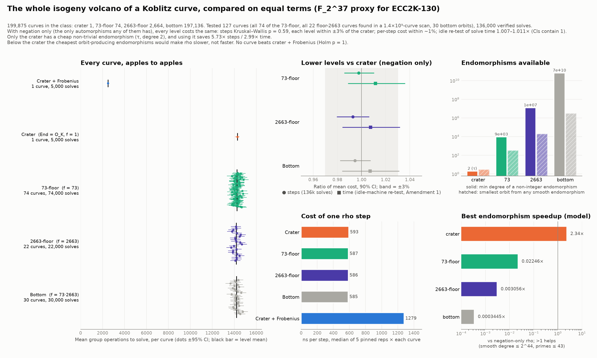

# Is any curve isogenous to a Koblitz curve better for Pollard rho? A full-volcano study

**Question.** ECC2K-130 is a Koblitz curve. Is there a curve isogenous to it, at
any level of its isogeny volcano, on which Pollard rho is faster? The
question is meant on equal terms: same group, same solver, same cost accounting.

**Answer (scoped; see Scope).** No. With the negation map, which is the only
automorphism group any curve in the class has, every level of the volcano
costs the same: identical step counts, identical step cost. The crater is the
only curve with a cheap non-trivial endomorphism (Frobenius τ, degree 2), and
it is the only one that gets a speedup. Below the crater, every endomorphism
that could form rho equivalence classes is so expensive that using it would
make rho 45× to 3,000× *slower*. No sampled curve beats the crater with
Frobenius (Holm-adjusted p = 1.0 on all 127 curves).



This is not ledger evidence. It is a standalone research study, and no
`H-*`, `EV-*` or `DEC-*` record was written. A Coordinator can promote it
through `/review-evidence` if wanted.

## 1. Object: an exact proxy for ECC2K-130

ECC2K-130 itself (2^60.8 rho steps) cannot be solved here, so the study uses the
same kind of curve at a solvable size:

| | proxy (this study) | ECC2K-130 |
|---|---|---|
| curve | y² + xy = x³ + 1 over F_2^37 | y² + xy = x³ + 1 over F_2^131 |
| #E | 4 · 149 · ℓ, ℓ = 230603167 ≈ 2^27.8 | 4 · ℓ, ℓ ≈ 2^129 |
| End of crater | O_K, K = Q(√−7), h = 1 | same |
| conductor [O_K : Z[π]] | 73 · 2663 (both inert in K) | 263 · 146505763881528721 (263 split, other inert) |
| isogeny class (a₂ = 0) | 199,875 curves | 3.85 · 10¹⁹ curves |

The class is a product of two depth-1 volcanoes, which gives four levels:

| level | End conductor f | curves | Galois orbits (size 37) | rational 73-isog. | rational 2663-isog. | 11-isogeny cycle |
|---|---|---|---|---|---|---|
| crater | 1 | 1 | 1 (b = 1, orbit size 1) | 74 down | 2664 down | 1 |
| 73-floor | 73 | 74 | 2 | 1 up | 2664 down | 74 |
| 2663-floor | 2663 | 2,664 | 72 | 74 down | 1 up | 2664 |
| bottom | 73·2663 | 197,136 | 5,328 | 1 up | 1 up | 2664 |

## 2. How the curves were obtained and classified

- **73-floor (all 74 curves):** explicit 73-isogenies from the crater
  (`floor73.gp`). The kernels are defined over F_q^18, with x-coordinates in F_q^9.
- **2663-floor and bottom:** a 2663-isogeny kernel lives in a 49,000-bit field,
  so these levels were reached by a random scan instead. 1.4 · 10⁹ random b
  were sieved in C with an x-only ladder ([N]P = O for two random points,
  `search.c`). The result was 2,029 class members, and **every one** was
  re-verified with PARI `ellcard` (#E = N exactly; 0 false positives). Split:
  2,006 bottom, 22 floor-2663, and 1 floor-73, which matches the expected
  2,000 / 27 ± 5 / 0.75. That 73-floor hit is one of the 74 curves enumerated
  independently, which cross-checks the enumeration.
- **Level test (exact):** 73 | [End E : Z[π]] ⇔ π is a scalar on E[73] ⇔
  E(F_q^18)[73^∞] ≅ (Z/73)². The alternative is Z/73². The test was validated
  against a slower exact test (X^(q⁹) ≡ X mod the 73-division polynomial).
- **Independent check:** the measured length of the horizontal 11-isogeny cycle
  (modular polynomial Φ₁₁; 11 splits in K) equals the order of [𝔩₁₁] in
  Cl(End E). That order is 1 / 74 / 2664 / 2664 for the four levels, and
  **all 127 sampled curves matched**.

## 3. Traits of every curve

The full table is `curve_traits.csv`, one row per curve, 28 columns.

**Per-level arithmetic** (`traits.py`, `smooth_endos.py`; exact integer computation):

| level | disc(End) | h(End) | min degree of non-integer endomorphism | smallest k with τᵏ ∈ End | smallest orbit from any smooth endomorphism* | best modelled class speedup vs negation-only* |
|---|---|---|---|---|---|---|
| crater | −7 | 1 | **2 (τ)** | **1** | 37 (τ, deg 2) | **2.34×** |
| 73-floor | −7·73² | 74 | 9,326 | 37 (π, trivial) | 333 (deg 7.1·10¹¹) | 0.022× |
| 2663-floor | −7·2663² | 2,664 | 12,410,246 | 37 | 20,239 (deg 7.5·10¹⁰) | 0.0031× |
| bottom | −7·194399² | 197,136 | 66,134,199,602 | 37 | 3.1·10⁶ (deg 2³⁷) | 0.00034× |

\*Exhaustive over endomorphisms of degree ≤ 2⁴⁴ whose degree factors over
primes ≤ 43, i.e. those that could be evaluated as a chain of small isogenies:
16.9M candidates at the crater, 225k on the 73-floor, 4.6k on the 2663-floor and
30 at the bottom. "Orbit" means the order of the endomorphism's eigenvalue on
⟨P⟩, excluding ±1, which negation already provides. Speedup model (stated, not
measured): one addition ≈ 45 field multiplications; a p-isogeny step ≈ p/2 + 2;
a Frobenius/Verschiebung step ≈ 2. Then S = √(K/2) · c_add / (c_add + (K/2 − 1) · c_α),
because the canonical representative needs the whole orbit at every step. For the
crater this predicts 2.34×; 2.78–2.99× was measured.

**Same for every curve in the class:** #E = 137439487532, cyclic group (it has
to be: n₁² | N forces n₁ ∈ {1, 2}, and E[2] has order 2 in characteristic 2);
Aut(E) = {±1}; embedding degree 3,116,259 (MOV/FR transfer is infeasible); not
anomalous; twist order 2 · 260999 · 263293.

**GHS Weil descent:** magic number m(b) = 1 at the crater (b ∈ F₂, so the
descent is degenerate) and m = 37 for every one of the other 126 sampled
curves, giving genus about 2³⁶. No level is weaker to descent.

## 4. Rho on equal terms (PROTOCOL.md)

Same solver (`rho.c`) on every curve: van Oorschot–Wiener distinguished points
(θ = 2⁻⁵), a 128-adding walk, BKL look-ahead and cycle escape by doubling. Every
group operation after Q is known is counted. **All 136,000 solutions were
verified** against the secret and by recomputing [k]P = Q.

| arm | curves | solves | mean group ops | ratio vs crater (90% CI) | median ns/step (pinned) |
|---|---|---|---|---|---|
| crater, negation only | 1 | 5,000 | 14,275 | 1 | 593 |
| 73-floor | 74 | 74,000 | 14,242 | 0.998 [0.986, 1.010] | 587 |
| 2663-floor | 22 | 22,000 | 14,172 | 0.993 [0.980, 1.006] | 586 |
| bottom | 30 | 30,000 | 14,198 | 0.995 [0.982, 1.008] | 585 |
| **crater, negation + Frobenius** | 1 | 5,000 | **2,492** | **5.73× fewer steps** [5.62, 5.84] | 1,279 |

- **H1 (is any curve faster than crater + Frobenius?):** no. Holm-adjusted
  p = 1.0 for all 127 curves, on both steps and time.
- **H2, steps:** no level effect (Kruskal–Wallis p = 0.59; ANOVA on per-curve
  means p = 0.46). Each level is equivalent to the crater within ±3% (TOST).
- **Heterogeneity between curves inside a level:** none detected (Kruskal–Wallis
  p = 0.09, 0.30 and 0.22).
- **Cost per step:** no level effect (p = 0.27; all within about 1%, CIs inside ±3%).
- **Steps against the trait columns:** no association with conductor
  (Spearman p = 0.35). GHS m and orbit size are constant below the crater.
- **Wall-clock time:** Frobenius saves 2.78–2.99×, less than the 5.73× in steps,
  because a Frobenius step costs 2.16× more here (37 squarings in a polynomial
  basis; a normal basis makes it a rotation).

### What went wrong, and Amendment 1

The pre-declared **H2-seconds** test failed its ±3% margin. In the main run the
lower levels came out 1.4–3.3% *faster* than the crater in wall-clock time.
Breaking time into ns per group operation per chunk showed equal medians
(624–629 ns) at every level, and load spikes in individual chunks. Three of the
crater's ten chunks were hit, while a `git fetch` ran concurrently. The main-run
data is kept as recorded. An additive amendment (`AMENDMENT-1.md`, frozen
before its data) reran the timing alone on an idle machine, pinned and
interleaved. The difference vanished and flipped sign: the ratios were 1.011,
1.008 and 1.007, and every 90% CI contains 1. At n = 2,000 per curve those
intervals are about ±2.5% wide, so a ±3% equivalence on raw solve time is
**not formally established**. The equivalence rests on its two factors, steps
(136k solves) and cost per step (pinned benchmark), which are each within ±3%.

## 5. Scope and transfer to ECC2K-130

Measured at m = 37, with this solver, on this machine. The transfer to m = 131
is an argument, not a measurement, and its premises are exact:
1. Isogenous curves over F_q have the same #E, so the same prime ℓ.
2. Every curve in the class is ordinary with j ≠ 0, so Aut = {±1}.
3. h(O_K) = 1, so the crater is the unique curve with τ ∈ End. For m = 131,
   τᵏ ∈ Z + f·O_K only for 131 | k (checked for k ≤ 400 with
   f = 263 · 146505763881528721).
4. A non-integer endomorphism in Z + f·O_K has degree ≥ 7f²/4. The smallest
   conductor below the ECC2K-130 crater is 263, which gives degree ≥ 121,000.

The m = 37 data shows the measurable consequence: at every lower level, rho
is negation-only rho, at the same per-step cost.

## Files

| file | role |
|---|---|
| `PROTOCOL.md`, `AMENDMENT-1.md`, `PROTOCOL.sha256` | frozen plan and additive amendment, with hashes |
| `rho.c` | solver (`run` / `bench` modes) |
| `search.c` | class-membership sieve |
| `floor73.gp`, `classify.gp`, `classify_all.gp`, `walk11.gp` | PARI/GP: 73-isogenies, level test, 11-cycle check |
| `traits.py`, `smooth_endos.py` | endomorphism-ring traits, smooth-endomorphism search |
| `run_rho.py`, `run_amend.sh`, `analyze_volcano.py`, `analyze_amend.py`, `plot_volcano.py` | execution and analysis |
| `sample.csv`, `curve_traits.csv`, `classified.out`, `floor73.out`, `cyc_*.out` | curves, classifications, traits |
| `results.json`, `results_amendment1.json`, `level_traits.json`, `smooth_endos.json`, `ns_per_step.csv` | results |
| `data/raw_solves.tar.gz`, `data/raw_amend.tar.gz`, `data/hits.tar.gz` | per-solve CSVs, scan hits |
| `pilot/` | the first 8-curve 73-floor study, 50,000 solves (superseded, kept) |

Reproduce: needs gcc with PCLMUL, PARI/GP ≥ 2.15, Python 3 with numpy, scipy and matplotlib.
```sh
gcc -O2 -march=native -o rho rho.c && gcc -O2 -march=native -o search search.c
gp -q floor73.gp > floor73.out
# scan (per core): ./search <seed> 350000000 > hits/hits_<core>.txt ; then classify_all.gp, cyc_*.gp
python3 run_rho.py && ./run_amend.sh && python3 analyze_volcano.py && python3 analyze_amend.py && python3 plot_volcano.py
```
