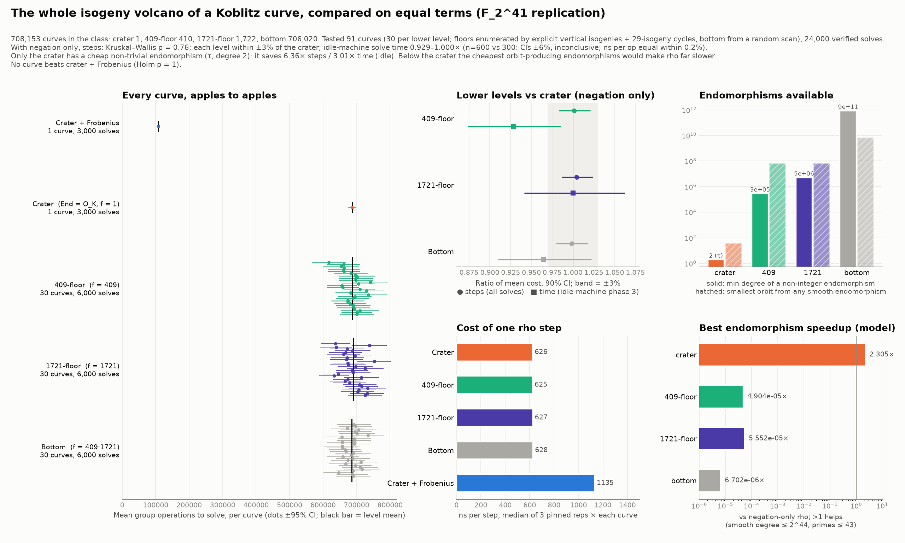
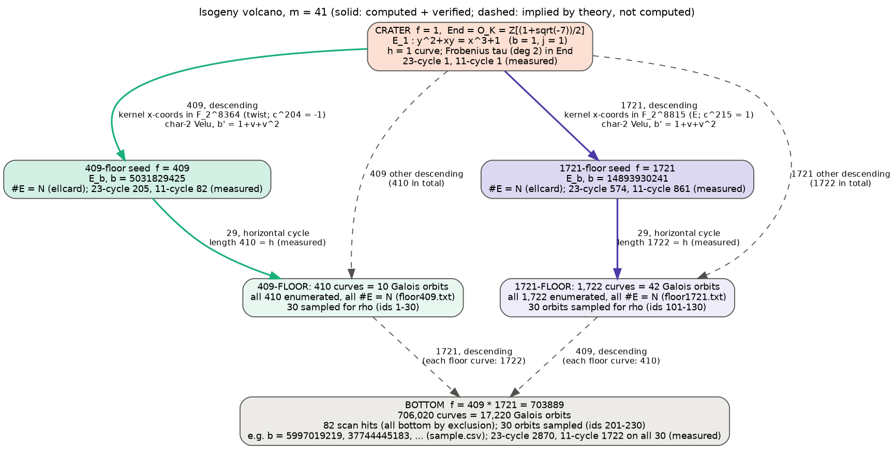

# Full isogeny-volcano Pollard-rho study, replicated at m = 41

**Question.** Is any curve isogenous to a Koblitz curve, at any level of its
volcano, better for Pollard rho, when compared on equal terms? This repeats
`../isogeny_volcano_rho_20261005` (m = 37) with a larger field (ℓ ≈ 2^39
against 2^27.8), a different conductor and a different class-group structure.

**Answer (scoped to m = 41, this solver, this machine).** The m = 37 result
replicates.
- **Negation only:** every level costs the same in steps (Kruskal–Wallis
  p = 0.76; each level within ±3% of the crater by TOST) and in cost per step
  (within 0.4%).
- **Only the crater speeds up.** It is the only curve with a cheap non-trivial
  endomorphism (Frobenius τ, degree 2). Using τ saves **6.36× steps** (95% CI
  6.20–6.53, against √41 = 6.40) and **3.0× time**.
- **No curve beats crater + Frobenius** (Holm-adjusted p = 1.0 on all 91 curves).
- **Lower-level endomorphisms make rho slower.** The cheapest ones that could
  form rho classes would make it about 10⁴–10⁵× slower.

This is a standalone study, not ledger evidence; no `H-*`, `EV-*` or `DEC-*`
record was written, and it is not a sealed `measured_bound`. The full report,
with every statement labelled DERIVED, MEASURED, INDEPENDENTLY VERIFIED or
PROPOSED, is [`report.pdf`](report.pdf) (source [`report.typ`](report.typ)).
The isogeny diagram is [`volcano_diagram.svg`](volcano_diagram.svg) (source
[`volcano_diagram.dot`](volcano_diagram.dot)). In it, solid edges were
computed here and their endpoints verified; dashed edges are implied by
volcano theory and were not computed.

## 1. Object

| | m = 41 (this study) | m = 37 (previous) | ECC2K-130 |
|---|---|---|---|
| curve | y² + xy = x³ + 1 / F_2^41 | same / F_2^37 | same / F_2^131 |
| #E | 4 · ℓ, ℓ = 549756390943 ≈ 2^39 | 4 · 149 · ℓ, ℓ ≈ 2^27.8 | 4 · ℓ, ℓ ≈ 2^129 |
| conductor [O_K : Z[π]] | 409 · 1721 (both inert) | 73 · 2663 (both inert) | 263 · 146505763881528721 |
| isogeny class (a₂ = 0) | 708,153 | 199,875 | 3.85 · 10¹⁹ |

| level | f | curves | Galois orbits | rational 409-isog. | rational 1721-isog. | 23-cycle | 11-cycle |
|---|---|---|---|---|---|---|---|
| crater | 1 | 1 | 1 | 410 down | 1722 down | 1 | 1 |
| 409-floor | 409 | 410 | 10 | 1 up | 1722 down | 205 | 82 |
| 1721-floor | 1721 | 1,722 | 42 | 410 down | 1 up | 574 | 861 |
| bottom | 703889 | 706,020 | 17,220 | 1 up | 1 up | 2870 | 1722 |

## 2. How the curves were obtained (a different route from m = 37)

At m = 37 the floors were reached by small explicit isogenies and a random
scan. At m = 41 the floors are too rare to scan for: the expected wait is about
90 minutes per 409-floor hit. So:

- **One vertical isogeny per floor** (`vert_lib.gp`, `v409.gp`, `v1721.gp`).
  The kernel x-coordinates live in F_2^8364 (the 409-kernel, on the quadratic
  twist, since c^204 = −1) and F_2^8815 (the 1721-kernel, on E, since
  c^215 = 1). Kernel generators were found with x-only López–Dahab ladders.
  The isogenous curve comes from the y-free char-2 Vélu formula
  b′ = 1/j′ = 1 + v + v², with v the sum of the kernel x-coordinates. That
  formula was checked against PARI `ellisogeny` on 6 random 73-isogenies at
  m = 37: 6/6 exact. Δ′ is pulled down to F_2^41 through its F_2-minimal
  polynomial, so no subfield embedding is needed.
  Results: b′ = 5031829425 (409-floor, 223 s) and b′ = 14893930241
  (1721-floor, 105 s), both with #E′ = N by `ellcard`.
- **Whole floors by horizontal walks** (`floors.gp`). [𝔩₂₉] has order 410 and
  1722, equal to each floor's class number. So one 29-isogeny cycle from each
  seed visits every curve on its floor: **410/410 and 1722/1722 distinct
  curves, every one with #E = N.**
- **Bottom:** a scan of 3 · 10⁸ random curves (`search.c`) gave 82
  class-member hits. Their level is exact by exclusion: none is the crater or
  in either fully enumerated floor, so all 82 are on the bottom (expected about
  0.25 floor hits).
- **Two independent level invariants on all 91 sampled curves**
  (`chk_*.out`): #E = N, and the measured 23- and 11-cycle lengths. **91/91
  match** (1/1, 205/82, 574/861, 2870/1722).

## 3. Traits (`curve_traits.csv`, `level_traits.json`, `smooth_endos.json`)

| level | disc(End) | h(End) | min degree of non-integer endomorphism | smallest k with τᵏ ∈ End | smallest orbit from a smooth endomorphism* | best modelled class speedup vs negation-only* |
|---|---|---|---|---|---|---|
| crater | −7 | 1 | **2 (τ)** | **1** | **41** (τ) | **2.31×** |
| 409-floor | −7·409² | 410 | 292,742 | 41 (π, trivial) | 6.8 · 10⁷ | 4.9 · 10⁻⁵ × |
| 1721-floor | −7·1721² | 1,722 | 5,183,222 | 41 | 6.8 · 10⁷ | 5.6 · 10⁻⁵ × |
| bottom | −7·703889² | 706,020 | 8.7 · 10¹¹ | 41 | 6.7 · 10⁹ | 6.7 · 10⁻⁶ × |

\*Same exhaustive search and cost model as m = 37: degree ≤ 2⁴⁴, factors over
primes ≤ 43, eigenvalue ±1 excluded; 16.9M candidates at the crater.

**Same for every curve in the class:** #E = 2199025563772, a cyclic group,
Aut = {±1}, embedding degree 6,704,346,231, not anomalous, and twist order
2 · 739 · 2543 · 585071.

**GHS magic number:** m(b) = 1 at the crater and 41 on all 90 sampled
lower-level curves, so no level is weaker to descent.

## 4. Rho on equal terms (PROTOCOL.md)

Same solver design as m = 37, parametrised by `params.h`. **All 24,000 solves
were verified** against the secret and by recomputing [k]P = Q.

| arm | curves | solves | mean group ops | ratio vs crater (90% CI) | median ns/step |
|---|---|---|---|---|---|
| crater, negation only | 1 | 3,000 | 686,341 | 1 | 626 |
| 409-floor | 30 | 6,000 | 687,192 | 1.001 [0.983, 1.021] | 625 |
| 1721-floor | 30 | 6,000 | 689,417 | 1.005 [0.986, 1.024] | 627 |
| bottom | 30 | 6,000 | 685,204 | 0.998 [0.980, 1.017] | 628 |
| **crater, negation + Frobenius** | 1 | 3,000 | **107,894** | **6.36× fewer** [6.20, 6.53] | 1,135 |

- **H1:** no curve is faster than crater + Frobenius (Holm-adjusted p = 1.0,
  on both steps and time).
- **H2, steps:** no level effect (Kruskal–Wallis p = 0.76; ANOVA on per-curve
  means p = 0.83). Every level passes TOST at ±3%.
- **H2, main-run time:** also equivalent at ±3%. Ratios were 0.997, 1.000 and
  0.992, with Kruskal–Wallis p = 0.52. Nothing else ran this time, so the
  m = 37 load confound did not recur.
- **Heterogeneity between curves inside a level:** Kruskal–Wallis p = 0.33,
  0.07 and 0.91.
- **Cost per step:** no level effect (p = 0.50; all within 0.4%).
- **Steps against conductor:** Spearman p = 0.68.

### Phase 3 (idle-machine timing) is inconclusive

This phase was pre-declared to run on an otherwise idle machine. Its time
ratios were 0.929 [0.874, 0.985], 1.000 [0.941, 1.063] and 0.964 [0.910,
1.022]. These intervals are about ±6% wide, wider than the ±3% margin, so by
the protocol's own rule the phase is **inconclusive**, not equivalent.

Breaking the time into its two factors explains the spread. Cost per operation
is identical: 683.2 ns at the crater against 683.4–684.4 ns below it, within
0.2%. All of the deviation comes from step counts in the small sample: the
409-floor's 600 solves happened to need 7.3% fewer steps. With 10× more
solves, the main run puts that same ratio at 1.001 [0.983, 1.021]. The phase
was underpowered (300 to 600 solves per arm, each taking 0.47 s). The protocol
fixed that sample size in advance, and it is reported as run.

## 5. Bugs caught before any data, and how

- **`rho.c`:** `Q2[32]` overflowed at M = 41, where QPOW = 40. In the
  pre-protocol smoke test, the negation-only solves it produced came back with
  `ok = 0` from the verifier, and the Frobenius-mode run stopped on the
  solver's own canonicalisation self-check. The table now has 64 entries;
  after the fix, 40/40 + 40/40 smoke-test solves verified. m = 37 was
  unaffected, since there QPOW = 28.
- **`vert.gp`:** a wrong Frobenius power and a type error in root finding were
  caught after the protocol hash but before any rho run. They are recorded in
  `PRE_DATA_FIXES.md`, with post-fix hashes in `PROTOCOL.post-fix.sha256`;
  the original `PROTOCOL.sha256` is left as frozen.

## 6. Scope

Measured at m = 41. Together with m = 37, the result holds at two field
sizes, two conductor structures and two class-group structures. Carrying it to
ECC2K-130 is still an argument resting on exact facts:
1. The isogeny class shares one ℓ.
2. Aut = {±1} on every curve in the class.
3. h(O_K) = 1, so τ ∈ End only at the crater.
4. Non-integer endomorphisms in Z + f·O_K have degree ≥ 7f²/4.

## Files

| file | role |
|---|---|
| `PROTOCOL.md`, `PROTOCOL.sha256`, `PRE_DATA_FIXES.md`, `PROTOCOL.post-fix.sha256` | frozen plan, hashes, and the pre-data fix record |
| `params.h`, `rho.c`, `search.c` | solver and sieve (m = 41 parameters) |
| `structure.gp`, `vert_lib.gp`, `v409.gp`, `v1721.gp`, `minpoly_*.gp`, `floors.gp`, `walk41.gp`, `chk_*.gp` | PARI/GP: class structure, vertical isogenies, floor enumeration, level checks |
| `floor409.txt`, `floor1721.txt` | all 410 and all 1,722 floor curves (b values) |
| `select.py`, `sample.csv`, `hits_all.txt`, `chk_*.out` | sample selection, scan hits, per-curve verification |
| `traits.py`, `smooth_endos.py`, `level_traits.json`, `smooth_endos.json` | endomorphism traits |
| `run_rho.py`, `analyze.py`, `plot.py`, `results.json`, `curve_traits.csv`, `ns_per_step.csv` | execution, analysis, figure, results |
| `report.typ` → `report.pdf` | status-labelled report (Typst 0.15) |
| `volcano_diagram.dot` → `.svg` / `.png` | isogeny diagram (Graphviz) |
| `volcano_rho_study.png` / `.svg` | quantitative figure |
| `data/raw_solves.tar.gz`, `data/raw_idle.tar.gz` | per-solve CSVs |
