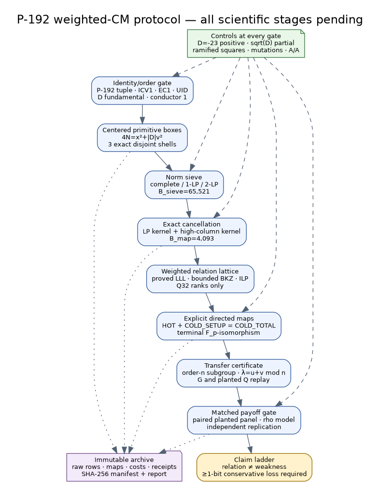

# Status and decision

This bundle freezes a new protocol, `EXP-SCURVE-1a8daf`. **No scientific
search, timing run, map census, ECDLP recovery, or replication has been
performed.** Every planned run is pending and the current claim ceiling is
`PROTOCOL_DESIGNED_UNEXECUTED`.

The native prerequisite is [crypto PR #1507](https://github.com/aburan28/crypto/pull/1507),
reviewed here at commit `315c7b417305db4f34ad01cb07c18ca2c55181ee`.
The prior archive is
[crypto-autoresearcher PR #1942](https://github.com/aburan28/crypto-autoresearcher/pull/1942),
reviewed at `5ed7dfbbc02a975e5919bc03b3020f1931e30813`. The prior
`EXP-SCURVE-647ade` is a different, immutable (L\le 2^{48}) generator-word
census. This protocol does not extend it, rerun it, or consume its run budget.

Labels used below are strict:

- **Verified (protocol):** local YAML parses, links resolve, arithmetic
  equalities and derived box counts pass the non-scientific checker.
- **Derived:** follows exactly from the frozen integers and equations.
- **Proposed:** an algorithm, budget, threshold, or future measurement.
- **Measured:** none.

# Why this is not another blind BFS

A bounded breadth-first isogeny walk allocates effort by graph distance. It can
inventory nearby curves, but it does not preferentially search for a cheap loop
returning to the source. This protocol instead enumerates principal quadratic
integers, whose ideal factorizations are loops by construction. It then uses a
larger algebraic relation base for yield, cancels every prime above the smaller
mappable base exactly, and optimizes only certified relation combinations.

That design separates four questions that are easy to conflate:

1. Does an abstract principal ideal relation exist?
2. Can its large-prime and high-degree support be cancelled exactly?
3. Can every remaining directed isogeny and the terminal isomorphism be built?
4. Does the resulting action make the same subgroup DLP cheaper after all
   search, construction, transfer, and verification costs are charged?

Only the fourth question can support a weakness claim.

# Exact object and CM assumptions

The curve is the exact short-Weierstrass NIST P-192 / secp192r1 tuple over

\[
p=6277101735386680763835789423207666416083908700390324961279.
\]

Its coefficient is (a=p-3), its published (b,G,n,h=1) are recorded in the
experiment specification, and its trace is

\[
t=31607402316713927207482677199,\qquad n=p+1-t.
\]

The three exact identity strings are:

| identity | value |
|---|---|
| ICV1 | `icv1-fp192-t31607402316713927207482677199-52e4af59` |
| EC1 | `EC1P192Cp192h5531c4a08bdb` |
| UID | `urn:ec-record:1:sha256:5531c4a08bdb64b6e86a6e30e9a08aa57edef7af15ac5f6d4d2a83a53bf2f646` |

The proposed order gate must independently replay

\[
D=t^2-4p=-24109379060336110122544161233113975664949272517896865359515
\]

and

\[
D=-5\cdot11\cdot31\cdot
14140398275856956083603613626459809774163796198179979683.
\]

Write `D_pi=t^2-4p` for the Frobenius-order discriminant, `D_K` for the
fundamental field discriminant, and `D_End` for the geometric
endomorphism-order discriminant. The archived derivation says the native
certificate proves `D_pi=D_K=D_End=D`: `p` does not divide `t`, so the curve is
ordinary, and `D_pi` is squarefree and fundamental, so `Z[pi]` is already
maximal and no larger geometric order can contain it. Thus the claimed result
is `End_over_Fbar_p(E)=Z[pi]=O_D`. That chain is an execution prerequisite
here, not a conclusion imported from the phrase “CM discriminant” or merely
from an archive URL. Since `D<-4`, the unit group must also be checked to be
exactly `{+1,-1}`.

# Centered deterministic search

For (\alpha=u+v\pi), with (\pi^2-t\pi+p=0),

\[
N(\alpha)=u^2+tuv+pv^2.
\]

Set (x=2u+tv). Then

\[
4N(\alpha)=x^2+|D|v^2,
\qquad x\equiv tv\pmod 2.
\]

For nonscalars, choose (v>0,x\ge0). Because the only units are
(\pm1), this quotients global sign and conjugation; (x=0) is retained as a
boundary representative. Primitivity is **exactly**
(\gcd(|u|,v)=1). Using (gcd(x,v)) would be wrong: the important
(\sqrt D=2\pi-t) control has (x=0,v=2) but is primitive because (t) is
odd.

The inclusive boxes and exact raw counts are:

| box | (1\le v\le V) | (0\le x\le X) | raw pairs | disjoint shell pairs |
|---|---:|---:|---:|---:|
| BOX-0 | 8 | 65,536 | 262,148 | 262,148 |
| BOX-1 | 64 | 1,048,576 | 33,554,464 | 33,292,316 |
| BOX-2 | 256 | 4,194,304 | 536,871,040 | 503,316,576 |

Traversal is shell, then increasing (v), then increasing parity-compatible
(x). Logical shards contain 1,048,576 records, except a final short shard.
The specification fixes domain separators, length fields, big-endian integer
encoding, shard digests, ordered shell roots, and a family root. Parallel
execution cannot alter the logical bytes. This explicitly repairs the digest
ambiguity identified in review of the prior archive.

For (v\ne0), the equation derives

\[
N(\alpha)\ge\lceil |D|/4\rceil
=6027344765084027530636040308278493916237318129474216339879.
\]

The earlier (2^{48}) word boundary therefore cannot explore these principal
norms. That is the mathematical reason to change representations.

# Smoothness, partials, and exact recombination

The proposed algebraic sieve base contains every split or ramified prime
(\ell\le65{,}521). The final mappable base contains the analogous primes
(\ell\le4{,}093). This enlargement is part of this new protocol version, not
an implementation default inherited from the old (ell\le113) census.

For a split prime, the smaller root (r_0) of
(r^2-tr+p=0\bmod\ell) names the positive ideal
((\ell,\pi-r_0)); the other root is its conjugate and has negative signed
coordinate. Ramified coordinates are stored modulo two, with rational scalar
content recorded separately. Exact ideal valuations, including prime powers,
come from ideal arithmetic/HNF—not from rational divisibility alone.

After base division, retain only:

- complete rows with residual 1;
- one-large-prime rows with a proven split prime
  (65{,}521<q\le2^{31}-1); or
- two-large-prime rows with exactly (q_1q_2), including multiplicity, both
  proven split primes in that interval.

Partials are not relations. Their signed oriented large-prime rows form an
exact integer matrix (L). A graph cycle may propose combinations, but only an
independently replayed arbitrary-precision solution of (L^Tc=0) is admitted.
The same exact-kernel process cancels every algebraic-base column above 4,093.
No high-degree edge receives an implicit zero cost.

The relation encoding is byte-exact and binds the curve UID, immutable
algebraic factor-base digest, shell-local index, centered point, norm
factorization, scalar content, increasing prime coordinates, explicit LP
incidence, and arbitrary-precision signed exponents. A separate map-support
manifest can evolve without changing algebraic relation IDs. One algebraic ID
covers a conjugate pair, while `:positive` and `:negative` directed variants
remain separate for map construction and cost.

Both LP cancellation and high-column elimination require saturated integer
kernel bases with HNF/SNF certificates. Their kernels are infinite; only the
frozen coefficient-bounded search is exhausted. For a combined vector `z`, the
verifier forms the exact oriented ideal `J(z)`, finds a normalized primitive
`beta=a+b*pi`, and proves `HNF(J)=HNF((beta))` and
`N(beta)=product_split(ell^abs(z_ell))*product_ram(ell^r_ell)`, where each
ramified `r_ell` is the projected bit in `{0,1}`, not its pre-projection signed
valuation. It does not assume a formal quotient of source generators is
already the primitive generator.

# Weighted solvers and costs

The exact row lattice is explored by:

- proved LLL with (delta=99/100,eta=51/100), 256-bit precision, and a
  10,000,000-swap cap in forward and reverse row order;
- deterministic single-thread BKZ at block sizes 20, 30, and 40, two tours and
  10,000,000 enumeration nodes per tour; and
- deterministic single-thread ILP with (|c_i|\le2^{20}), 50,000,000 nodes,
  zero requested gap, and exact replay of every feasible result.

Solver exhaustion is censored. `optimal` is permitted only with an
independently checked zero-gap/proof record; otherwise the label is
`BEST_FOUND_WITHIN_BUDGET`.

Each realized directed edge and composite reports the raw tuple

\[
(\mathrm{FpM},\mathrm{FpS},\mathrm{FpI},\mathrm{FpAddSub},
  \mathrm{polyCoeffM},\mathrm{logicalBytesRW}).
\]

`HOT` is online evaluation and required conversions/checks.
`COLD_SETUP` is root/kernel/map/dual construction, verification,
serialization, and cleanup from an empty experiment cache. Every record must
satisfy componentwise

\[
\mathrm{COLD\_TOTAL}=\mathrm{COLD\_SETUP}+\mathrm{HOT}.
\]

The source UID, target UID, root, orientation, kernels, maps, and endpoints key
an edge record. A median cost for a degree or an undirected prime is never a
measured path cost. Relation discovery and solver cost remain separate and are
included in a whole-method cold comparison unless an explicit public
precomputation reuse count is also reported.

Q32 weights normalize `FpM` to (2^{32}), use ties-to-even rounding, and are
derived from 16 deterministic cases with one warmup and 11 ABBA repetitions.
They are **ranking only**. They cannot alter membership, acceptance, stopping,
or a security claim. The fixed calibration panel receives medians, MAD, IQR,
range, and leave-one-case-out rank sensitivity—not an iid population interval.

# Map, subgroup, and terminal certificates

Every promoted candidate must archive:

1. every source/target curve identity and coefficient tuple;
2. `ell`, both roots, a global orientation proof that `ker(phi)` is the
   separable cyclic order-`ell` subgroup scheme
   `E[ell] intersect ker(pi-[r])=E[(ell,pi-r)]` on the actual source—not the
   generally much larger full kernel of `pi-[r]`—plus kernel polynomial,
   rational map, exceptional divisor, and dual-composition identity;
3. every intermediate model and the final (\mathbf F_p)-isomorphism back to
   the exact source UID—not merely an equal (j)-invariant;
4. the exact ordered edge circuit—not an infeasible expanded degree-about-
   `2^192` rational function—normalized primitive `beta=(a,b)`, norm,
   relation, independent terminal unit signs, and both conjugate eigenvalues;
5. subgroup replay on (G) and every planted (Q=[d]G), including
   (\phi(Q)=[d]\phi(G)), dual identities, and
   (\psi(G)=[\lambda]G,\psi(Q)=[\lambda]Q).

The transfer cost includes forward maps, applicable duals, conversions,
exceptional handling, terminal isomorphism, validation, and return to the
source representation. Moving a DLP to an isogenous curve does not make it
easier by itself.

The primary consumer is an explicitly implemented automorphism-quotiented rho
walk. A certified order of `lambda` requires a factorization/order certificate
for `n-1`; order unknown blocks the orbit-payoff lane. The walk must prove
equivariance and charge orbit canonicalization, map/inverse evaluation,
partitioning, cycle detection, distinguished points, exceptions, and recovery.
No ideal square-root-of-action-size gain is assumed. Explicit orbit enumeration
is capped at 64; larger actions need a separately certified non-enumerative
consumer. A decomposition alternative must certify a balanced basis of
`<(n,0),(-lambda,1)>` and charge the actual multi-scalar algorithm. An
eigenvalue or determinant alone is not a speedup.

The exact candidate and generic walks are deliberately an open pre-dispatch
gate: a versioned amendment must freeze state/coefficient invariants, partition
and update rules, increment derivation, canonicalization and baseline negation,
distinguished points, collision recovery, success/termination, memory,
parallelism, targets, and whole-attack accounting. Until then, the planted
panel is functional/map holdout evidence only and cannot produce a DLP speedup
or weakness label.

# Controls and statistical confidence

Positive controls include the (D=-23) order-three norm-2 relation. The
P-192 (\sqrt D=2\pi-t) row is a deliberately partial control: its
factorization is (5\cdot11\cdot31\cdot C), algebra must pass, and map/payoff
must reject its unavailable (C)-degree support and scalar action on
(E(\mathbf F_p)[n]). Ramified squares, inert primes, wrong orientations,
unmatched large-prime columns, twist/UID substitutions, subgroup mutations,
and map mutations are negative controls.

The scalar reference scan and segmented sieve must agree byte for byte on a
small admitted box. Forward/reverse enumeration and one-worker/eight-worker
sharding must recompose to identical roots. All-ones, shuffled, and perturbed
Q32 weights may move ranks but not accepted relation IDs. A/A timing and
operation controls must be consistent with parity.

The deterministic census is a finite population: report exact counts and
digests, with no binomial interval and no extrapolation outside the boxes.
Smoothness-model comparisons are descriptive. Timing claims use 31 paired
public planted targets at interval widths 28, 32, and 36, identical targets,
ABBA order, 10,000 target-cluster bootstrap resamples, and exact
Clopper--Pearson success intervals. Width 36 COLD is primary; HOT and COLD are
co-primary for the claim. A fresh clean rebuild on an independent environment
must agree in direction.

Calibration, relation discovery, and solver outputs are selection data.
Exactly one directed candidate and consumer are frozen before planted target
scalars or timing-order material are derived. More than one holdout candidate
requires a new preregistered familywise rule; choosing the fastest afterward
is invalid.

# Claim ladder and stopping rules

- `ABSTRACT_RELATION_FOUND`: exact principal row plus independent ideal/HNF replay.
- `DIRECTED_MAP_CHAIN_VERIFIED`: complete explicit maps, terminal isomorphism,
  subgroup and planted-point action.
- `RANKED_CANDIDATE`: Q32 order only; no speed claim.
- `SCOPED_ADVANTAGE`: exact consumer gate closed; HOT and COLD paired 95%
  upper endpoints below 1; 31/31 primary functional successes; controls and
  independent replication.
- `MATERIAL_WEAKNESS_CANDIDATE`: additionally conservative HOT and COLD ratios
  at most 0.80 with a verified action mechanism.
- `WEAK_CURVE_WITHIN_SCOPE`: full-order derivation gives at least 1.0
  conservative security bit loss, ratio at most 0.5, interval lower bound above
  1 bit, and independent replication.

A bounded planted solve alone never establishes full-order P-192 weakness. A
timeout, OOM, missing map, solver cap, or partial shell is `INCOMPLETE`. A valid
full null can say only `NO_WEAKNESS_FOUND_WITHIN_SCOPE` for these boxes, bases,
bounds, solvers, and maps.

The family has eight frozen pending roles: preflight/controls, three sequential box
shells, exact recombination and solver panel, map/cost replay, matched planted
panel, and independent rebuild/replication. Canonical RUN IDs are allocated and
rechecked only at dispatch; content-only names are not reservations. All are pending. A new Coordinator
dispatch decision must bind final clean source and protocol commits before any
run manifest exists.

# Requirement-to-evidence matrix

- **Experiment, decision, and run family:** ledger records, experiment spec,
  and `run-family.yaml` are complete as protocol; every role is pending.
- **Exact P-192 tuple and identities:** `inputs.curve` is specified; execution
  replay is pending.
- **Discriminants, factorization, and maximal order:** `inputs.cm_order`
  contains the local identities; native certificate replay is pending.
- **Centered boxes and ordering:** `centered_norm_search` is specified and its
  raw counts pass the static checker.
- **Norm, smoothness, and LP rules:** `factor_bases_and_smoothness` is
  specified and unexecuted.
- **Encoding, orientation, and recombination:**
  `relation_encoding_and_recombination` is byte-exact; implementation is
  pending.
- **HOT/COLD and Q32:** `cost_contract` is specified; there are no calibration
  data.
- **LLL/BKZ/ILP:** `weighted_solver` fixes choices and budgets; no solver ran.
- **Maps, subgroup, and terminal certificates:** schemas are specified; there
  is no candidate.
- **Controls, statistics, stop and claim rules:** frozen but not exercised.
- **Archive outputs:** the protocol bundle and `SHA256SUMS` are present; all
  scientific outputs are pending.

# Canonical-knowledge disposition

The current `knowledge/frontiers/ecdlp` material and the P-192 archive PR were
checked as context. No canonical graph or knowledge finding changes here:
there is no new measured relation, map, speedup, or obstruction. Promotion is
expressly deferred until an independently replayed run supports a scoped
claim.

# Immediate gate

The next action is implementation admission, not a scientific search: add the
segmented sieve, exact independent ideal verifier, partial/high-column kernels,
directed map and cost records, optimizers, supervised runner, and independent
replayer to the native repository; freeze the exact matched DLP consumer in a
versioned amendment; pin and review the commits; then create a fresh dispatch
decision. Until those gates, every result field remains empty.
