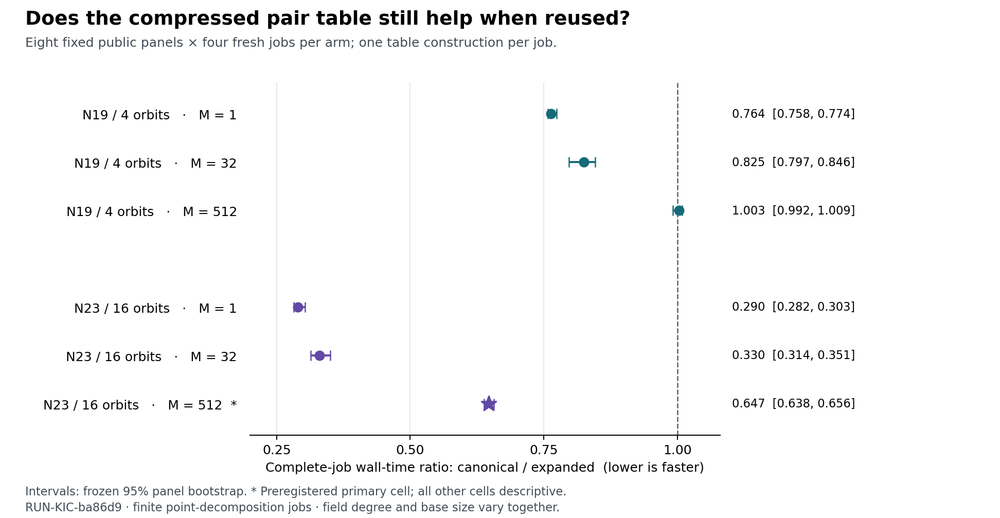

# P9: cold-job reuse of exact Koblitz pair tables

**Disposition:** the Coordinator accepts the finite result in [DEC-20260922-38ca94](../../ledger/decisions/DEC-20260922-38ca94.md), following the sealed source and permanently blind reviews. This report and that decision are packaged together for the final archive.

The larger finite case retained a whole-job benefit with 512 queries per table build. Its preregistered paired canonical/expanded time ratio was **0.6468878314**, with the fixed-panel bootstrap interval **[0.6384838473, 0.6562119807]**. The observed predicate passed: valid controls and replay, all 384 jobs valid, median ratio at most 0.90, and upper endpoint below 1. The smaller N19/K4 case was near parity at 512 queries.

This is a finite public-synthetic point-decomposition experiment. It does not supply a new end-to-end IC/rho comparison, isolate field-size scaling, or establish a general-purpose implementation optimum.

## Whole-job observations

| Regime | Queries per job | Expanded median (ms) | Canonical median (ms) | Paired time ratio | Fixed-panel 95% interval |
| --- | ---: | ---: | ---: | ---: | --- |
| n19_k4 | 1 | 6.346 | 4.873 | 0.763668 | [0.757505, 0.773728] |
| n19_k4 | 32 | 8.023 | 6.625 | 0.824614 | [0.796991, 0.845794] |
| n19_k4 | 512 | 31.249 | 31.306 | 1.003193 | [0.991915, 1.008675] |
| n23_k16 | 1 | 75.389 | 21.786 | 0.289595 | [0.282152, 0.302761] |
| n23_k16 | 32 | 79.705 | 26.258 | 0.329567 | [0.314096, 0.350548] |
| n23_k16 | 512 | 148.782 | 95.199 | 0.646888 | [0.638484, 0.656212] |

The millisecond columns are marginal medians over 32 fresh jobs per arm and cell. The ratio is a different aggregation: median 4 repetitions within each panel/arm, then the median of 8 paired panel ratios. It is not the quotient of the two marginal medians. Only N23/K16, M=512 was the preregistered primary cell; the other five cells are descriptive. The bootstrap describes eight fixed public lists and is not an IID population or scaling-law claim.

The producer and source reviewer use a fresh `Random("PAIR-REUSE-v1-bootstrap")` stream for each cell. The blind reviewer used one continuously advancing stream across the six cells; the protocol prose did not explicitly fix this reset scope. It obtained the same point estimate and a primary interval of [0.6384838473, 0.6564915175]. The [deterministic reconciliation](bootstrap_stream_reconciliation.json) reproduces both endpoint sets from unchanged receipts and accounts for the entire 0.0002795368 upper-endpoint difference. The executed source was frozen before measurement, so its per-cell interval remains the canonical run analysis. Both sealed outputs are retained, both pass the declared predicate, and future protocols must state RNG lifetime and sampling primitive explicitly. No measurement or sealed statistic was changed.

## Which work changed

At N23/K16, M=512, median table construction was 62.335 ms for the expanded table and 15.800 ms for the canonical table, with a further 0.057 ms for normal-basis preparation. All-query transport and replay was 58.547 ms versus 60.670 ms. The construction saving therefore remained useful after reuse. Whole-process timings also charge startup, input, validation, output and cleanup; component medians must not be added and presented as the median total.

At N19/K4, M=512, table construction fell from 2.011 ms to 0.671 ms plus 0.037 ms normal preparation, while all-query transport and replay rose from 16.886 ms to 18.440 ms. The complete jobs were near parity. The result supports retaining both implementations when choosing a method for a particular finite workload.

The N23 table contained 260,361 distinct full pair sums and 5,661 canonical entries. Logical key/row payload was 3,124,332 bytes versus 317,016 bytes. For the primary512-query jobs, median process peak RSS was 18,407,424 bytes versus 3,768,320 bytes. Logical payload and RSS are different measurements; neither is an asymptotic memory bound.

## Data, controls and accounting

- Exactly one native control, one independent Python checker and 384 native benchmark processes ran. All completed valid; there were no retries, replacements, censors or missing scheduled jobs.
- Each measured job started a fresh native process, reconstructed and validated its base, read a complete 512-point panel file, built one table and processed the declared prefix. Native Popen-to-sole-wait4 wall time includes the entire job.
- Native controls checked all 524,288 degree-19 and 8,388,608 degree-23 field values for normal-coordinate round trips and Frobenius rotation, together with field/group controls, complete pair support, transported witnesses and actual false-certificate rejection. Independent Python replay rebuilt the bases, fields, panels, pair sets and witnesses.
- Each regime has 8 panels × 512 entries. N19 has 4,076 distinct points across panels and 20 repeated entries; N23 has 4,094 distinct points and 2 repeated entries. Prefixes and technical repetitions are not independent new targets.
- N19 control panels contained 3,679 SAT and 417 UNSAT queries; N23 contained 4,096 SAT and 0 UNSAT. This is fixed-panel coverage, not an exhaustive certificate for every possible three-point target.
- The 384 jobs performed 69,760 query executions including repeated panels/prefixes. Native job wall times summed to 17.233359785 s; parent witness validation summed to 3.325994 s. These totals are experiment accounting, not one-target algorithm costs.
- Outer control, checker and benchmark supervisor walls were 11.111667 s, 75.609363417 s and 25.593812375 s respectively. Their descendant CPU accounting overlaps child receipts and must not be added to child CPU.
- The host had 14 logical CPUs and other active work. One-minute load averages before/after the benchmark were 13.875 and 16.8046875. No quiet-host, core-affinity, OS-cache-flush or cross-machine result is claimed. A new preregistered replication would be needed to test transfer.

## Custody and corrections

Scientific snapshot: 43f937a8a08507affb7d4c15eab76977fa7c058e, parent 8fc93f84761c646ebde6c3856f5bcba7fb581278, 112 bound paths. Root verified all 1,567 members of the aggregate raw archive against its manifest. Source and native binary hashes remained unchanged across all scientific phases.

Source/native-control admission was frozen at a927ecd5a9f22440ccb1fdb84433fe1b74f39ca8. The actual control launch used c79f81a4e4b4ccb1054e923759e7ef577119a010 after a byte-preserving executable-mode installation correction. Checker admission was 81e417140ec28c8f7904ae2bcb184ce896fbb0b5; benchmark admission was 7571be12120da2cf2a306e76dd1426746b572fdb.

The first incomplete Stage-A implementation is preserved with its hashes. The later inference-capacity interruption is recorded separately. Neither event launched a scientific process. The frozen build copy omitted execute permission; [install_native.py](install_native.py) supplies the explicit byte-preserving installation step for reproduction.

The original generated run manifest used a descriptive certificate label outside the schema enum. [manifest_v2.yaml](../../experiments/EXP-KIC-d9c828/runs/RUN-KIC-ba86d9/manifest_v2.yaml) changes only that label to `decomposition` and adds explicit supersession metadata. The original remains byte-identical. The exact registry entry, companion files, reverse binding and unchanged measurement fields passed scoped checks. No record correction reran a process.

## Review and next action

[TASK-20260922-a0c874](review/source_report.yaml) holds on source, transport and cost integrity. [TASK-20260922-a5ab4c](review/blind_report.yaml) holds on independently reconstructed panels, witnesses and paired statistics, with 312,644 checks passed. The [blind addendum](review/blind_addendum.yaml) corrects its data-unit wording to 4,096 panel positions per regime and documents its RNG stream choice; the original three blind artifacts remain byte-identical. These are independent sessions within this project and arithmetic/statistical replay, not fresh timing replication on another host. The declared review-independence check passed.

The Coordinator retains the finite reuse result and preserves the frozen hypothesis and specification heads. Knowledge promotion is not warranted for this one finite implementation measurement. The concrete next action is design work for a public-synthetic integration protocol at the actual cold-job setup/query-reuse scope, with relation generation, rank, matrix, extraction, final verification, complete cost and matched baseline charged before any IC/rho inference. The existing no-key-recovery mathematical boundary remains. No such next protocol has yet been frozen or dispatched.

Run RUN-KIC-ba86d9; experiment EXP-KIC-d9c828; approval DEC-20260922-10be27. All factual sources in this report are internal and hash-bound.
