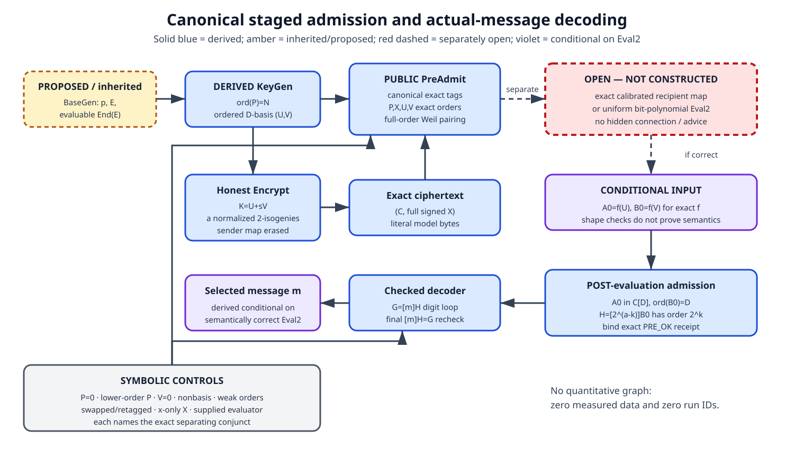

# Canonical admission and decoder repair

## Result at a glance

**[DERIVED]** One repair mechanism is sufficient at the frozen interface:
canonical exact encodings, prime-power exact-order tests, a full-order Weil
pairing test for the ordered `E[2^a]` basis, and a strict separation between
public pre-admission and post-evaluation decoder admission.

**[DERIVED]** On every admitted honest relation, exact ciphertext equality is
injective in `(m,r)`, and a semantically correct pair
`A0=f(U), B0=f(V)` decodes the actual selected message. **[PROPOSED / OPEN]**
The exact calibrated recipient map and a uniform two-point evaluator remain
separate obligations. An autonomous base generator for the inherited complete
evaluable `End(E)` representation also remains open.

**[MEASURED]** There are no measured data, samples, uncertainty intervals, or
run IDs. Scientific, implementation, formalizer, and experiment run counts are
all zero. **[INDEPENDENTLY VERIFIED]** Nothing in this producer round; the
frozen review plan assigns that work to later independent tasks.

## Question and exact identities

The question was whether the `P=0` and `V=0` defects can be repaired without
smuggling in the missing evaluator. The exact symbolic-family slice is:

- `p>3`, `p=3 mod 4`, `F_(p^2)=F_p[i]/(i^2+1)`;
- `D=2^a`, `N=5^b`, `a>=2`, `b>=1`, `N>4D`, with exact corresponding
  valuations in `p+1`;
- the exact source model `E:y^2=x^3+x` and an exact canonical codomain `C`;
- exact-order `P in E[N]`, `X in C[N]`;
- a role-tagged ordered basis `(U,V)` of `E[D]`;
- an honest normalized separable degree-`D` map `f:E->C` with
  `ker(f)=<U+sV>`, `s=m+2^k r`, and full signed `f(P)=X`.

There are no concrete sampled endpoints. Curve equality means complete
field/model/coefficient bytes; point equality includes full signed `y`.

## Methods

**[DERIVED]** The work was a zero-run symbolic derivation. It reproduced the
prior `P=0` and `V=0` collision fibers, replaced membership by exact
prime-power orders, used the Weil-pairing determinant criterion for a basis,
typed the two admission stages, derived bounded honest rejection sampling,
proved exact relation injectivity, and carried correct evaluator outputs through
a checked power-of-two digit decoder.

Internal source links are collected under “Sources and provenance.” No external
primary source was fetched. The KB items were used only at their stated
reported/abstract tier, not as proof of this derivation or of novelty.

## The staged predicate

**[DERIVED]** For `N=5^b`, exact order is `[N]T=O` and `[N/5]T!=O`. For
`D=2^a`, it is `[D]T=O` and `[D/2]T!=O`. Apply these to `P,X` and `U,V`,
respectively.

**[DERIVED]** Compute `w=e_D(U,V)` and require exact order `D`. In coordinates
relative to any `E[D]` basis, `w` is a primitive root raised to the coordinate
determinant; exact order means the determinant is odd, hence invertible modulo
`2^a`. This makes `(U,V)` an ordered basis and excludes `V=0` and dependent
pairs.

`PreAdmit` checks only canonical parameters/models, curve and point membership,
exact `P,X,U,V` orders, and the pairing basis. It returns a receipt binding all
full bytes. `PostAdmitDecode` is unavailable until a separate evaluator returns
`A0,B0`; it checks their exact target model, `[D]A0=O`, `ord(B0)=D`, and
`ord([2^(a-k)]B0)=2^k` before decoding.

The complete predicate is
[admission-predicate.yaml](../../../coordination/design/TASK-20261006-ca9189/tasks/TASK-20261006-04e1d5/admission-predicate.yaml),
and exact serialization is
[exact-model-encodings.yaml](../../../coordination/design/TASK-20261006-ca9189/tasks/TASK-20261006-04e1d5/exact-model-encodings.yaml).

## Honest compatibility and retry accounting

**[DERIVED, conditional on BaseGen]** On the exact source curve,
`E(F_(p^2))=E[p+1]`. Exact cofactor projections give uniform `E[N]` and `E[D]`
samples. An `E[N]` point is a generator with probability `24/25`; an ordered
pair in `E[D]^2` is a basis with probability `3/8`. With the bounded exact
uniform-point sampler, the KeyGen failure bound is

`epsilon_base + (t_P+2t_B)2^-t_R + (1/25)^t_P + (5/8)^t_B`.

For encryption `K=U+sV` has exact order `D` because its `U` coefficient is
one. An `a`-step normalized degree-two quotient constructs the sender’s honest
`f_s`, `C`, and `X=f_s(P)` in polynomial bit time. Coprime degree preserves
the exact `N` order of `X`. The sender map/chain is erased and is never a
recipient input. Details are in
[honest-keygen-compatibility.yaml](../../../coordination/design/TASK-20261006-ca9189/tasks/TASK-20261006-04e1d5/honest-keygen-compatibility.yaml).

## Injectivity and actual-message decoding

**[DERIVED]** If two degree-at-most-`D` maps to the same exact `C` agree on
exact-order `P`, then a nonzero difference would have degree both at least `N`
and at most `4D`, impossible. Exact same ciphertext therefore gives the same
map and kernel. In an admitted basis,

`<U+sV>=<U+tV>`

forces `s=t mod D`: equality gives `U+sV=z(U+tV)` for a unit `z`; compare the
`U` coordinate to get `z=1`, then the `V` coordinate. The canonical range of
`s=m+2^k r` then gives the same `m` and `r`.

**[DERIVED]** The same coordinate comparison proves `ord(f(V))=D`; also
`f(U)=-[s]f(V)`. Therefore

`H=[2^(a-k)]f(V)`, `G=-[2^(a-k)]f(U)=[m]H`,

with `ord(H)=2^k`. A checked binary digit loop followed by `[m]H=G` returns
the actual selected message. This theorem remains explicitly conditional on
the semantic evaluator contract; local image-order tests alone cannot prove
that arbitrary outputs are `f(U),f(V)`. The exact theorem appears in
[injectivity-decoder-theorem.yaml](../../../coordination/design/TASK-20261006-ca9189/tasks/TASK-20261006-04e1d5/injectivity-decoder-theorem.yaml).

## Nearby-object and proves-too-much controls

**[DERIVED]** Symbolic controls identify one exact separator each:

- `P=0` or lower-order `P`: `[N/5]P!=O`.
- `V=0`: `[D/2]V!=O` and the full-order pairing.
- Exact-order but dependent `U,V`: `ord(e_D(U,V))=D`.
- Lower-order `B0` or `H`: post-evaluation exact image orders.
- A swapped tuple relative to the frozen key: ordered role/full-byte binding.
- A retagged or isomorphic-only model: canonical full model bytes.
- `x(X)` only: full signed point encoding.
- A supplied correct evaluator: decoding succeeds, but the evaluator-separation
  gate forbids calling the supplied object a construction.

The full traces are in
[attack-gates.yaml](../../../coordination/design/TASK-20261006-ca9189/tasks/TASK-20261006-04e1d5/attack-gates.yaml).

## Limitations and obligation map

**[PROPOSED / OPEN]** Three exact interfaces remain:

1. autonomous `BaseGen` for the complete evaluable `End(E)` key distribution;
2. exact calibrated recipient-map construction;
3. uniform bit-polynomial `Eval2` for `f(U),f(V)` with all preprocessing,
   memory, output, success, and failure costs.

All O1--O6 scheme obligations remain open. In particular, a solver followed by
this conditional decoder is an attack upper bound, not an IND-CPA reduction.
See
[scheme-obligation-delta.yaml](../../../coordination/design/TASK-20261006-ca9189/tasks/TASK-20261006-04e1d5/scheme-obligation-delta.yaml)
and
[proof-search-map.yaml](../../../coordination/design/TASK-20261006-ca9189/tasks/TASK-20261006-04e1d5/proof-search-map.yaml).

No security, novelty, practicality, deployment, finality, family closure, or
universal EndRing-PKE possibility/impossibility claim is made.

## Visual record

The editable source is [admission-decoder-flow.mmd](admission-decoder-flow.mmd)
and the matching vector rendering is
[admission-decoder-flow.svg](admission-decoder-flow.svg). The current PDF is
`admission-decoder-report.pdf`.

No quantitative graph applies: there are no measured data, samples,
uncertainty intervals, or run IDs. The prior study directory and curated ECDLP
frontier were checked conceptually for affected canonical graph content; this
interface derivation changes no supported canonical relationship, so no shared
graph was edited.

## Sources and provenance

- **Internal:** the frozen producer handoff, preparation manifest, and
  pre-recorded review plan under `TASK-20261006-ca9189`.
- **Internal:** `GOAL-SSI-2fa82a`, `RQ-SSI-1946c9`, and
  `DEC-20261006-3025de` for the exact task and claim boundary.
- **Internal:** corrected composition `TASK-20261006-97107d`, its next-action
  recommendation, and the prior producer’s blind statement, proof map,
  scheme delta, attack gates, and evaluator reconstruction report.
- **Internal:** the prior visual report
  `research/ssi-endring-pke/2026-10-06-low-degree-evaluator-search/evaluator-search.md`,
  read from the tracked `HEAD` object because the path is sparse-checkout omitted.
- **Internal methodology:** `AGENTS.md`, `CLAUDE.md`, the Idea Generator role,
  inventor protocol, target profile, scheme-construction contract/template,
  and the propose-ideas/research-visuals skills.
- **KB, reported tier only:** `KN-OPEN-013`, `KN-TECH-028`, `KN-TECH-029`,
  `KN-TECH-080`, `KN-LIT-073`, `KN-LIT-074`, and `KN-LIT-7642`.

External primary retrievals by this worker: none. Novelty status: `unverified`.
