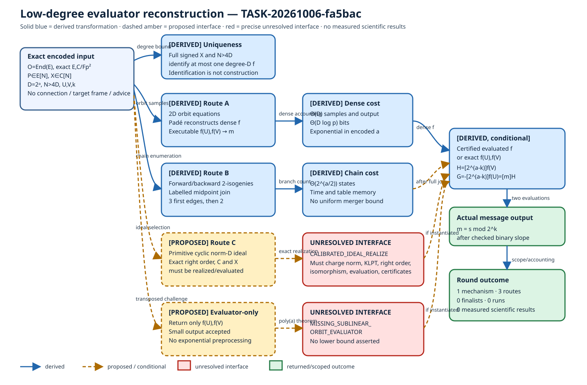

# Low-degree evaluator reconstruction search

## Result at a glance

**[DERIVED]** One reconstruction mechanism was examined through exactly three
routes: orbit rational/Padé interpolation (A), recursive degree-two chain
lifting (B), and calibrated quaternion-ideal realization (C).  A separate
evaluator-only challenge asked for only `f(U),f(V)`.  The round has **zero
finalists** under the required uniform bit-polynomial contract.

**[DERIVED]** Route A is nevertheless a complete finite upper bound: `2D`
public orbit samples determine the dense rational map, its signed `y` action,
and therefore the actual message.  Its sample, workspace and output costs are
linear or quasilinear in numeric `D=2^a`, hence exponential in encoded `a`.

**[DERIVED]** Route B has a sound/complete labelled midpoint join, but balanced
forward/backward enumeration uses `Theta(2^(a/2))` states before unproved
instance-specific merger savings.  **[PROPOSED]** Route C would use a primitive
cyclic norm-`D` ideal, but the exact target-calibrated ideal realization
interface is not instantiated.  **[PROPOSED]** Transposed Padé evaluation has
small output but retains `Theta(D)` construction/data dependence.

**[MEASURED]** There are no measured scientific results in this round.  No
scientific, implementation, formalizer, or experiment run was performed.

## Question and scope

**[DERIVED]** The exact input is represented/evaluable `O=End(E)`, represented
`E,C/F_(p^2)`, `P in E[N]`, `X in C[N]`, `D=2^a`, `N=5^b>4D`, `U,V in E[D]`,
`k=floor(a/2)`, and the frozen encoding/admission interface.  The search did
not add `Hom(E,C)`, a connecting isogeny, target order/action/frame,
orientation, retained sender map/dual, per-instance advice, or exponential
preprocessing.

**[DERIVED] Exact curve and subgroup identities.** This is a symbolic-family
round, not an instantiated curve run.  `E` and `C` mean their complete exact
field-labelled public model encodings, not aliases or `j`-invariants.  `P` and
`X` have exact order `N` on their respective labelled curves; `U,V` are a
labelled basis of `E[D]`.  The sought arrow is a separable homomorphism
`f:E->C` of exact degree `D` with full signed image `f(P)=X` and cyclic kernel
`<U+sV>`.  No concrete endpoint coefficient tuple was sampled or measured.

## Methods

**[DERIVED]** All declared inputs and the complete prior BATCH-066c3b producer
packet were read.  The ECDLP known-results map was checked as a duplication
control, although this PKE evaluator is outside its generic-rho/index-calculus
taxonomy.  Selected knowledge records on interpolation, two-power isogenies,
KLPT, Deuring conversion, ideal-to-isogeny representations and path-finding
were read at their actual knowledge-entry tier.  No primary source was fetched
by this worker, so novelty remains unverified.

**[DERIVED]** The mathematical work was symbolic: derive the uniqueness bound;
write the exact orbit equations; count chain branches; type the ideal
realization interface; challenge dense-output reasoning with a transposed
evaluator; and carry every actual evaluator output through the retained
decoder.  No execution outcome is inferred.

## The uniqueness boundary

**[DERIVED]** If two degree-at-most-`D` homomorphisms `f,g:E->C` agree on an
order-`N` point `P`, then a nonzero `f-g` has at least `N` kernel points while
`deg(f-g)<=2deg(f)+2deg(g)<=4D`.  Strict `N>4D` therefore forces `f=g`.

**[DERIVED]** This does not construct `f`.  The nearby relaxed observable
`x(f(P))` collides on `f` and `-f`; the full signed point separates them.
Pairing-only observations forget the slope.  An unnormalized codomain permits
model-isomorphism ambiguity.  If `N<=4D`, this degree argument stops separating
maps, without thereby exhibiting a collision.

## Route A: orbit rational/Padé interpolation

**[DERIVED]** For `i=1,...,2D`, set
`u_i=x([i]P)` and `v_i=x([i]X)`.  Strict `N>4D` makes the `u_i` distinct.
Solve

`A(u_i)=v_i B(u_i)`, with `deg(A)<=D`, `deg(B)<=D-1`.

The rational function `R=A/B` is unique after projective scaling because the
cross-difference of two candidates has degree at most `2D-1` and `2D` roots.
The signed `y` map is recovered from the nonzero differential scalar
`c=R'(x(P))y(P)/y(X)`, yielding
`f(x,y)=(R(x),yR'(x)/c)`.  Coprimality, exact degree, the cleared curve
identity, exact codomain and `f(P)=X` are checked before use.

**[DERIVED]** This returns an executable dense map and, after evaluating `U,V`,
the actual message.  But it needs `2D` samples and `Theta(D log p)` output bits.
Any `O(D)` claim is dense-representation-scoped and is exponential in `a`.
The route is therefore a finite baseline, not a finalist.

## Route B: recursive degree-two chain lifting

**[DERIVED]** A nonbacktracking degree-two chain has three first edges and two
continuations at each later depth.  The forward table records the normalized
midpoint, composed evaluator, image of `P`, and forbidden dual edge.  The
backward table transports the unique preimage of `X` on odd `N`-torsion using
the dual and multiplication by `2^(-1) mod N`.

**[DERIVED]** A match requires both a midpoint-curve isomorphism and equality
of the transported labelled point.  Curve-only collision is incomplete.  At
the balanced split, time and table memory are `Theta(2^(a/2))` up to polynomial
field factors.  Cycles and mergers are recorded by full state; they do not
supply a uniform compression theorem.  No sound/complete prefix predicate was
found beyond validity and immediate nonbacktracking checks.  Final endpoint
and column tests are full-path checks.

## Route C: calibrated ideal realization

**[PROPOSED]** The desired ideal is a proper primitive left `O`-ideal `I` with
`nrd(I)=D`, `[O:I]=D^2`, cyclic local type, right order geometrically matching
`End(C)`, and an evaluated realization `f_I:E->C` satisfying `f_I(P)=X`.

**[DERIVED]** Fixed-rank HNF/SNF checks verify a supplied lattice but do not
select the target class.  Equivalent-ideal/KLPT output does not automatically
preserve exact norm `D`, cyclic type, public `C`, or signed `X`.  Every
saturation, division, norm search, KLPT attempt, right-order conversion,
codomain isomorphism, automorphism calibration, evaluator, normalization and
certificate cost must remain explicit.

**[PROPOSED]** The precise missing interface is
`CALIBRATED_IDEAL_REALIZE(O,E,C,P,X,D,I)`.  No bit-polynomial implementation or
uniform failure theorem for it is supplied here.  An ideal/order label is not
an evaluated map.

## Evaluator-only challenge

**[PROPOSED]** The exact target is a uniform polynomial-time `PreEval` producing
a polynomial-size data structure and an `Eval2` returning only `f(U),f(V)`.
Dense output size is not used to reject this target.

**[DERIVED]** The transposed Padé candidate can avoid emitting every
coefficient, but it still constructs `2D` orbit equations and a `D`-dimension
structured solve or reusable data structure.  Direct query application also
retains numeric-`D` dependence.  Recursive compact circuits reduce to Route B;
compact ideal labels reduce to Route C.  The exact unresolved operation is
`MISSING_SUBLINEAR_ORBIT_EVALUATOR`.  This is not a lower bound.

## Exact map-to-message path

**[DERIVED]** For any certified returned evaluator, compute
`A0=f(U)`, `B0=f(V)`, then

`H=[2^(a-k)]B0`, `G=-[2^(a-k)]A0`.

Check `ord(B0)=D` and `ord(H)=2^k`, recover `t` from `G=[t]H` with the checked
binary digit loop, verify the equality, and return `m=t`.  Since
`f(U)=-[s]f(V)` and `s=m+2^k r`, this returns the selected message
`m=s mod 2^k`.  The charge is two complete evaluator calls plus certificates
and `O(k^2+a)` group operations.  `W`, `Y`, an ideal, an order, or an
unevaluated chain alone does not enter this decoder.

## Positive, negative, and contradictory findings

- **[DERIVED, positive finite result]** A dense public map and actual message
  are reconstructible from `2D` orbit samples under the exact honest
  preconditions.
- **[DERIVED, negative scoped cost result]** That dense representation does
  not meet the bit-polynomial gate; balanced chain lifting also remains
  exponential.
- **[PROPOSED, unresolved]** Exact calibrated ideal realization and a genuinely
  sublinear/transposed evaluator remain named interfaces.
- **[DERIVED, contradiction check]** There is no contradiction with
  BATCH-066c3b: that packet had no map, while this round adds a charged finite
  dense baseline and still selects no finalist.
- **[INDEPENDENTLY VERIFIED]** None in this producer round.  Independent review
  is outside this handoff.

## Limitations and next checks

**[DERIVED]** This round establishes no public/recipient asymmetry, security
reduction, practicality result, deployment recommendation, novelty claim,
universal obstruction, or official research-state change.  All inherited
admission obligations remain.

**[PROPOSED]** A future check would need one of two exact theorems: either a
poly(`a,log p,B`) evaluator for the orbit-defined rational map with no
`Theta(D)` preprocessing, or a complete calibrated ideal selector/realizer
with exact norm/codomain/column and evaluated output.  Either must be reviewed
before implementation or formalization.

## Visual record

The editable diagram is [evaluator-flow.mmd](evaluator-flow.mmd); the vector
rendering is [evaluator-flow.svg](evaluator-flow.svg).  Solid blue edges are
derived transformations, dashed amber edges are proposed interfaces, and red
nodes are precise unresolved interfaces.  The PDF version of this report is
`evaluator-search.pdf` and includes the current vector diagram.

No quantitative graph is included because this round generated no measured
data, samples, uncertainty intervals, or run IDs.  The study directory and the
curated ECDLP frontier were checked for affected canonical graph content.  No
supported relationship changed, so no canonical graph was edited.

## Sources and evidence identifiers

There are no new run/evidence IDs.  Internal source IDs used are
`GOAL-SSI-2fa82a`, `BATCH-066c3b`, `DEC-20261005-fcb424`, and the prior
`TASK-20261005-e18332` artifacts.

- **Internal:** [goal](../../../ledger/goals/GOAL-SSI-2fa82a.yaml),
  [checkpoint](../../../ledger/goals/GOAL-SSI-2fa82a/checkpoints/BATCH-066c3b.yaml),
  [decision](../../../ledger/decisions/DEC-20261005-fcb424.yaml), and
  [producer packet](../../../coordination/design/TASK-20261005-d32b60/tasks/TASK-20261005-e18332/), for the
  exact inherited interface, failures, decoder, and nonduplication.
- **Internal:** [construction-source-boundaries.md](../../../analysis/ideation-RQ-SSI-1946c9-20261005/construction-source-boundaries.md), as a prior source-intake
  boundary that is not upgraded to this worker's primary retrieval.
- **Internal:** [robert-torsion-boundary.md](../../../analysis/ideation-RQ-SSI-1946c9-20261005/robert-torsion-boundary.md), as a full-action boundary note;
  no evaluator program is inferred.
- **KB:** [KN-LIT-073](../../../knowledge/literature/KN-LIT-073.md),
  [KN-LIT-074](../../../knowledge/literature/KN-LIT-074.md),
  [KN-TECH-028](../../../knowledge/techniques/KN-TECH-028.md),
  [KN-TECH-029](../../../knowledge/techniques/KN-TECH-029.md), and
  [KN-OPEN-013](../../../knowledge/open-problems/KN-OPEN-013.md), at their
  reported KLPT/Deuring/path tier and limits.
- **KB:** [KN-LIT-209](../../../knowledge/literature/KN-LIT-209.md),
  [KN-LIT-527](../../../knowledge/literature/KN-LIT-527.md),
  [KN-LIT-836](../../../knowledge/literature/KN-LIT-836.md),
  [KN-LIT-961](../../../knowledge/literature/KN-LIT-961.md),
  [KN-LIT-1084](../../../knowledge/literature/KN-LIT-1084.md), and
  [KN-LIT-1248](../../../knowledge/literature/KN-LIT-1248.md), as
  abstract/first-pages-level isogeny computation and representation pointers.
- **KB:** [KN-LIT-7642](../../../knowledge/literature/KN-LIT-7642.md), at its
  abstract-page effective-Deuring arithmetic tier only.

External primary retrievals by this worker: none.  Literature novelty status:
`unverified`.
