# Corrected scope and mathematical boundary

**[Derived; producer submission]** This new packet corrects the control semantics and source/visual evidence rejected in BATCH-9681e3. It supplies no fresh J4/J5 verdict. J1-J3 remain the reviewed historical conditional statements, not new findings.

The fixed symbolic slice is $p>3$ prime, $p=3\pmod4$, $q=p^2$, $E:y^2=x^3+x$, $D=2^a$, $N=5^b>4D$, $a\ge2$, $b\ge1$, $v_2(p+1)=a$, $v_5(p+1)=b$, and $k=\lfloor a/2\rfloor$. Public keys bind ordered roles $(E,P,U,V)$; ciphertexts are exact short-Weierstrass model $C$ plus full signed $X$. No concrete sampled endpoints exist.

For $s=m+2^kr\in[0,D)$, the honest relation uses the normalized separable degree-$D$ map $f:E\to C$ with kernel $\langle U+sV\rangle$ and $f(P)=X$. Normalization means $f^*\omega_C=\omega_E$, with $\omega=dx/(2y)$ on each fixed model. The sender's fixed degree-two formulas determine exact coefficients at every step.

**[Retrieved + derived]** Hasse's primary norm-addition formula, with degree multiplicativity, transfers from endomorphisms to $\operatorname{Hom}(E,C)$: compose $f,g$ with one fixed nonzero $u:C\to E$ and cancel $\deg u$. Hence
$$
\deg(f+g)+\deg(f-g)=2\deg f+2\deg g,\qquad\deg(f\pm g)\le4D.
$$
A nonzero map killing a point of order $M$ has $M\le\deg_s(h)\le\deg(h)$. Its difference need not be separable. These bounds compare maps on the same exact source and target.

**[Correction]** Equal x-only observations give $g(P)=\pm f(P)$. The bound then gives $g=f$ or $g=-f$. The latter violates simultaneous normalization in $p>3$, since $[-1]^*\omega_C=-\omega_C$. Even without normalization, $f$ and $-f$ have the same kernel. Thus the old normalized cross-message collision claim is withdrawn. Full signed X remains the original serialization rule; this example does not establish its necessity for message injectivity under these hypotheses.

**[Correction]** $P=O$ or lower-order $P$ removes the $N>4D$ proof premise. The applicable bound uses $M=\operatorname{ord}(P)$: uniqueness still holds for $M>4D$. Failure to derive it when $M\le4D$ does not exhibit a collision. Both P and X exact-order tests must be weakened for the corresponding honest objects to pass.

**[Limit]** There are no measured data or runs. Source checking, symbolic derivation, parsing and rendering are documentation checks. BaseGen, exact recipient map and uniform Eval2 remain open.

\newpage

# Controls with the exact implication

The [standalone blind statement](../../../coordination/design/TASK-20261007-8b5d55/tasks/TASK-20261007-efaa15/blind-control-statement.yaml) contains the submitted definitions, parameters, classifications and control claims without derivations. The [control matrix](../../../coordination/design/TASK-20261007-8b5d55/tasks/TASK-20261007-efaa15/control-matrix.yaml) adds complete acceptance traces. All examples fix one key before comparing messages.

**C1/C2 -- proof-premise controls.** Zero or lower-order P passes weakened membership, and the same weakening for X is required. Full admission rejects the penultimate-multiple order tests. No same-exact-C different-message pair is claimed. For $b=1$ there is no nonzero lower-order 5-power point.

**C3 -- exact symbolic witness W_V_ZERO.** Take one key $(E,P,U,O)$ with $\operatorname{ord}(U)=D$, $\operatorname{ord}(P)=N$. Let $f_U$ be the fixed normalized quotient by $\langle U\rangle$, C its exact coefficient output, and $X=f_U(P)$. Messages0,1 with r=0 have identical kernels and use the identical map and exact ciphertext. Membership-only V and pairing tests accept; exact V order and primitive pairing reject. All retained P/X and U exact orders, model/count checks, degree D and normalization hold conditional on the original valid BaseGen slice.

**C4/C5 -- exact symbolic witness W_DEPENDENT.** Take one key $(E,P,U,U)$, $a\ge4$, $k\ge2$. Messages0,2 with r=0 give $U$ and $3U$, generating the same exact subgroup. At every quotient stage its unique order-two subgroup is unchanged, so the identical normalized formulas give the same exact C and $f_U(P)$. Both U,V have exact order D, but $e_D(U,U)=1$. Individual orders or pairing membership accept; primitive pairing rejects. C5 reuses this witness: there are **two unique symbolic ciphertext witness families**, not three.

**C6 -- post-output observation control.** Without semantic evaluator correctness, choose B of order $D/2$ and $A_j=-s_jB$, with $s_0=0$, $s_1=2^{k-1}$, $a\ge4$. Then H has order $2^{k-1}$ and both projected G values are O. Weakened post membership and final equality accept t=0 for both; it is wrong for message $2^{k-1}$. This is projected-output ambiguity, not an honest-map or ciphertext collision. Exact B/H orders reject.

**C7/C8/C10 -- encoding/receipt controls.** Relative role swaps, retagging and changed receipts/target tags fail the exact-byte premise. Freshly binding a swapped key changes the key. Detectable malformed inputs reject; universal wrong-key authentication is not promised.

**C9 -- normalized observation control.** The x-only argument on page1 yields equality of normalized maps. The f/-f normalized cross-message witness is not retained.

**C11/C12 -- method ceiling.** Anyone supplied the correct pair $f(U),f(V)$ can use the public conditional decoder; this constructs no Eval2. An EndRing/evaluator solver followed by decryption is an attack upper bound. Security needs the opposite implication via a scheme-game attacker to an EndRing solver, with a complete reduction.

\newpage

# Inspected evidence and open obligations

Exactly four theorem families were examined. [Source evidence](../../../coordination/design/TASK-20261007-8b5d55/tasks/TASK-20261007-efaa15/source-evidence.yaml) binds retrieval times, hashes, locators, source types, inspected scope, hypotheses and applications; the linked notes preserve the inspected statements and derivations.

1. **Pairing -- primary statement/proof inspected.** Victor S.Miller, *The Weil Pairing, and Its Efficient Calculation*, J.Cryptology17(2004), Definition1, journalpp.236-237 (PDF2-3), and Proposition7/proof, pp.243-245 (PDF9-11); nondegeneracy proof pp.244-245. This primary research paper uses perfect K, coprime n,p and full geometric torsion. The determinant-to-basis implication remains internally derived. Enge2014 remains supplemental exposition; earliest Weil1940 and all proof dependencies are not claimed inspected. Two local printed editorial defects are recorded in the [pairing note](../../../coordination/design/TASK-20261007-8b5d55/tasks/TASK-20261007-efaa15/sources/pairing.md); [publisher paper](https://link.springer.com/content/pdf/10.1007/s00145-004-0315-8.pdf).

2. **Degree norm -- primary statement inspected.** Helmut Hasse, *Zur Theorie...III*, J.reine angew.Math.175(1936), §1 eq.(1), p.193; initial proof pp.193-195. Milne's second-edition monograph II§6 supplements dual/multiplicativity and the parallelogram lemma; it remains typed as a monograph. Hom transfer and the 4D bound are derived, not misquoted. [Norm note](../../../coordination/design/TASK-20261007-8b5d55/tasks/TASK-20261007-efaa15/sources/degree-norm.md).

3. **Normalized quotient -- formulas inspected; general uniqueness partial.** Vélu, *Isogénies entre courbes elliptiques*, C.R.Acad.Sc.Paris273(26July1971), pp.238-241: original French scan images, §3 eqs.(8)-(13), Remark2 differential equality and Remark3 descent. Specialize the formulas to a rational order-two point; composing a steps gives normalized separable degree D. Sutherland2025 Theorems5.11/5.13 provide explicit supplemental exposition, but the original full categorical existence/uniqueness binding remains missing. Fixed-short-model rigidity is derived separately. [Quotient note](../../../coordination/design/TASK-20261007-8b5d55/tasks/TASK-20261007-efaa15/sources/normalized-quotient.md).

4. **Counting -- primary statement inspected.** Schoof1985, Math.Comp.44(170), §1 p.483, §2 setup p.484, §3 p.490: deterministic cardinality for characteristic other than2,3, with supplied field presentation. It explicitly does not compute full group structure. The prime-power point-order tests are separate elementary derivations; counting does not certify a basis, scalar Frobenius or End(C). [Counting note](../../../coordination/design/TASK-20261007-8b5d55/tasks/TASK-20261007-efaa15/sources/point-counting.md); [original author-hosted scan](https://reneschoof.github.io/ctpts.pdf).

**[Limit]** Reading source statements/relevant proofs is not independent review or formal verification. Strict source gaps above remain partial; no future J5 outcome is asserted.

**[O1-O6 all open]** O1 still lacks the exact hard-problem sampler/distribution and complete evaluable End(E) generation. O2 lacks BaseGen, recipient map and Eval2. O3 lacks full correctness/failure bounds, especially epsilon_eval. O4 lacks the efficient private lift and costs. O5 lacks the correctly directed game reduction. O6 lacks the complete adversarial view, repeated-use/side-channel/game analysis and authentication. See the [exact obligation deltas](../../../coordination/design/TASK-20261007-8b5d55/tasks/TASK-20261007-efaa15/scheme-obligation-delta.yaml).

**[Accounting]** Scientific0; implementation0; formalizer0; experiment0. No Eval2 search or speed claim. dominated_by: n/a (no result claimed). sota_delta: no attack; conceptual/source/control correction only. No closures, security, novelty, practicality, deployment or finalist claim.

\newpage

# One routing specification, current rendered view

The [routing specification](../../../coordination/design/TASK-20261007-8b5d55/tasks/TASK-20261007-efaa15/visual-routing.yaml) fixes every node identity, label, edge direction and control disposition. The [editable Mermaid](correction-flow.mmd) is generated from it; the official Mermaid library renders the [SVG](correction-flow.svg). The current SVG is converted to vector PDF and included here, without a hand-drawn replacement. The graph shows evidence/control routing; its arrows are not isogenies or security reductions.

{height=7.0in}

No quantitative graph applies: zero data, samples, measured costs, run IDs or uncertainty intervals. Historical graph bytes remain unchanged; this new scoped view corrects their control semantics. Actual SVG and every PDF page are visually inspected and their exact hashes bound in [provenance](../../../coordination/design/TASK-20261007-8b5d55/tasks/TASK-20261007-efaa15/provenance.yaml). A fresh reviewer verdict remains separate from producer completion.
